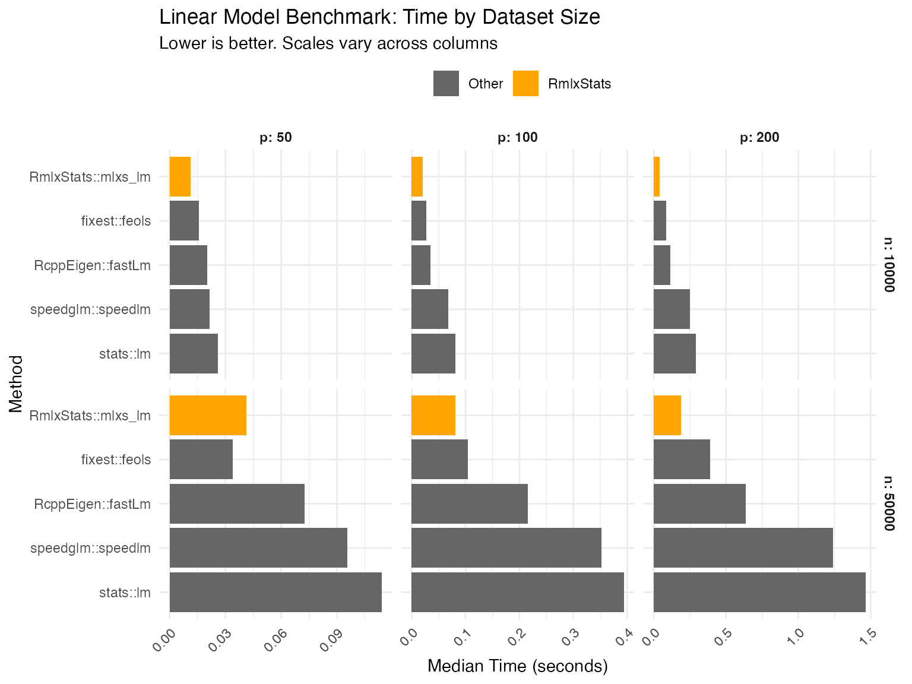
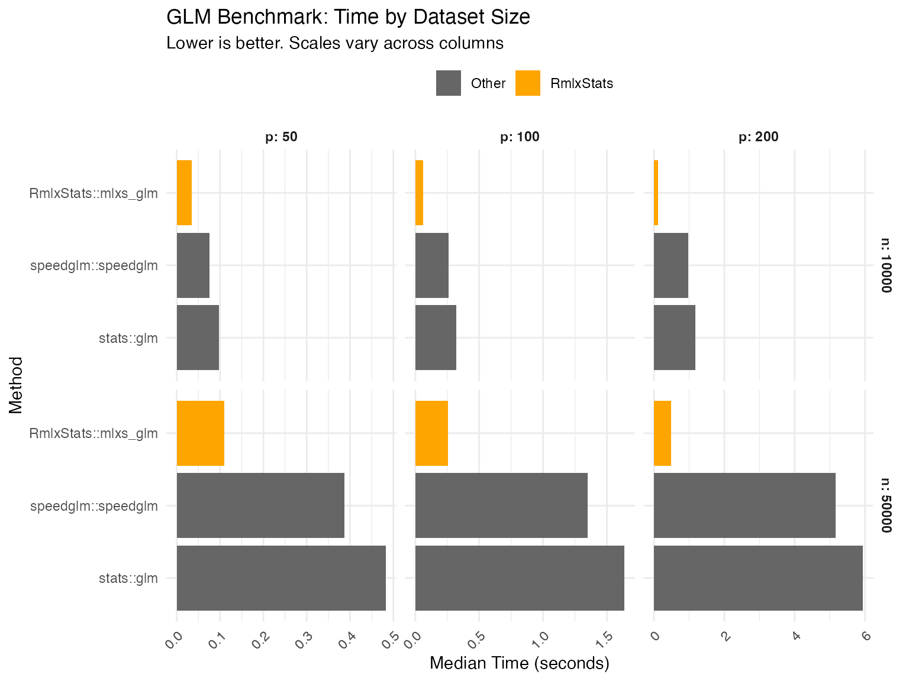
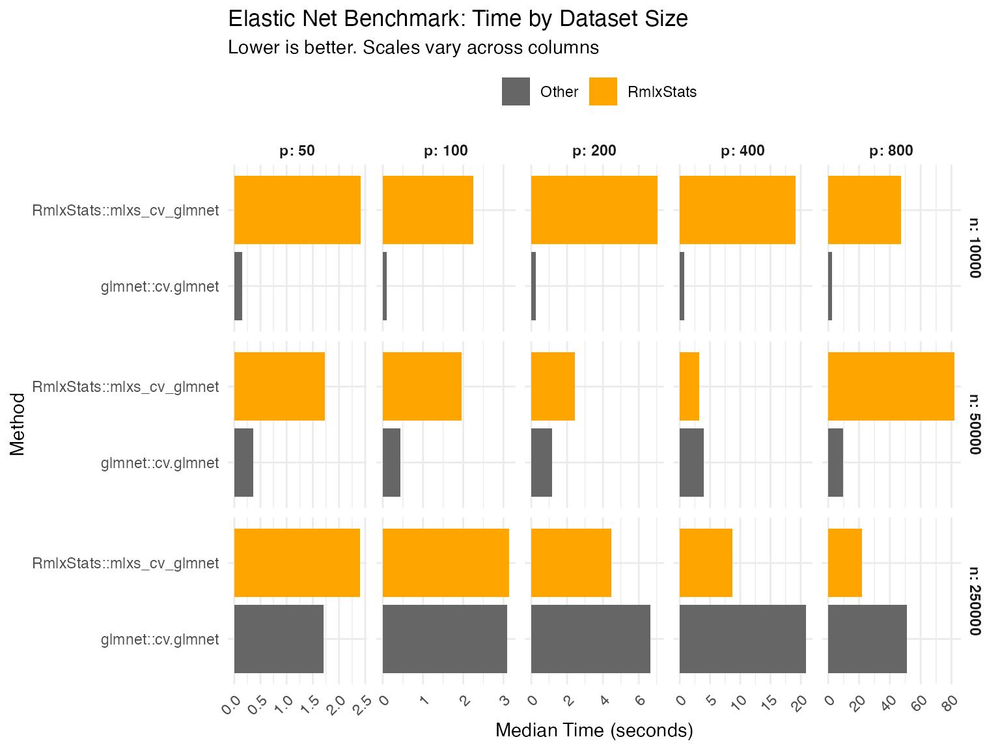
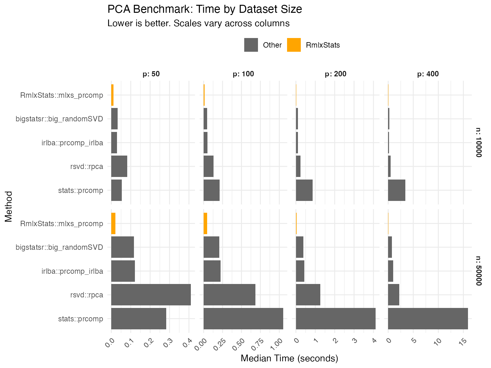
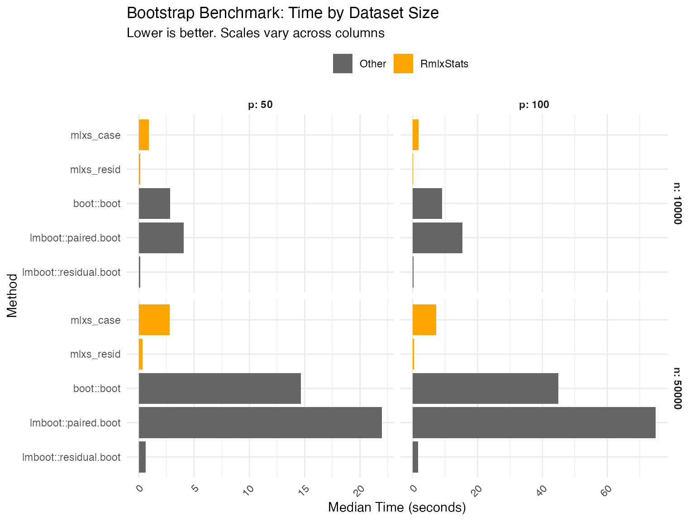
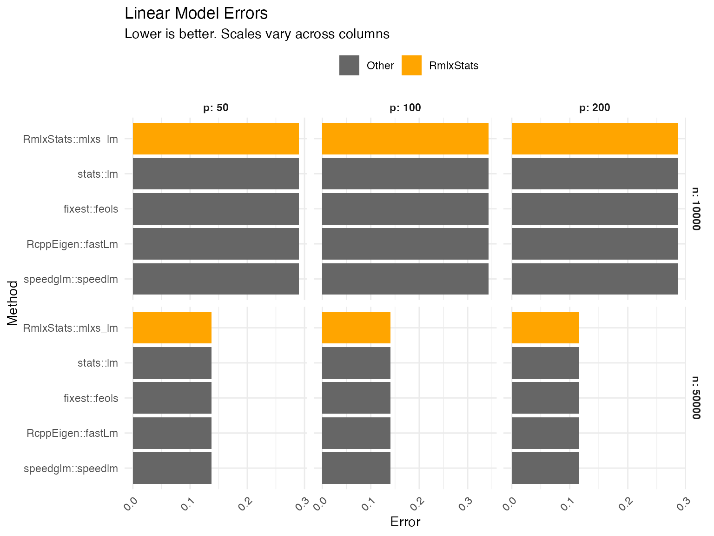
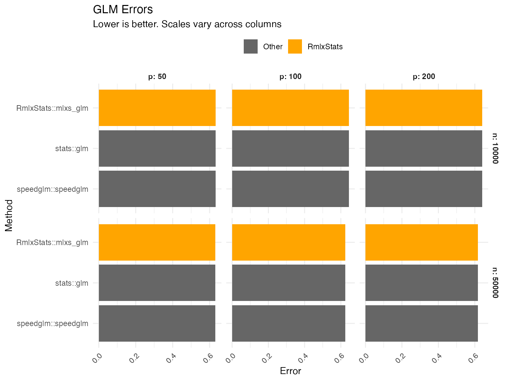
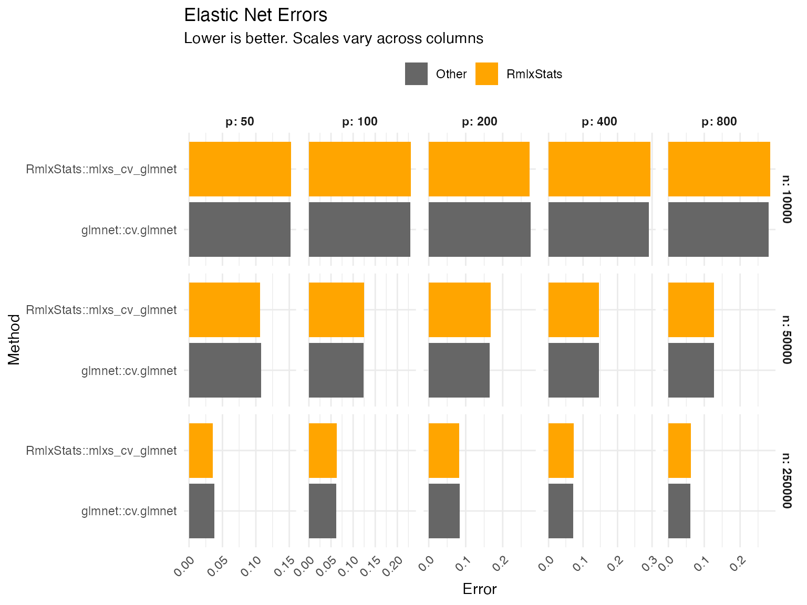
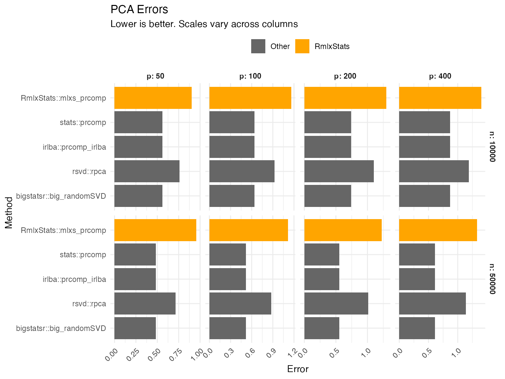
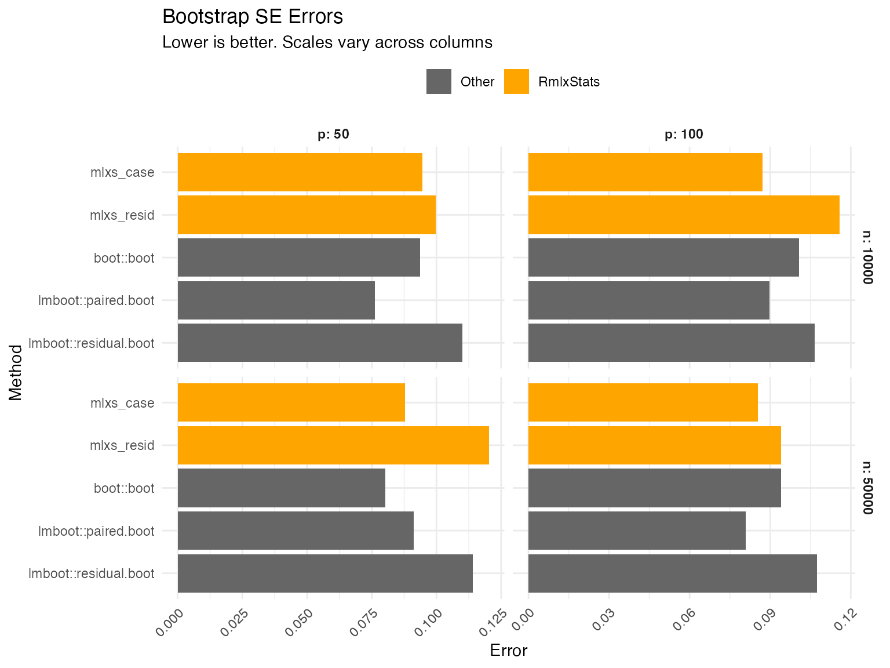

# Benchmarks

We benchmark RmlxStats against base R and specialized fast fitting
packages, across varying numbers of cases (`n`) and predictors (`p`). We
also check accuracy.

Benchmarking was run on an M2 Macbook Air.

Setup code

## Benchmarking Code

### Data Generation

Code

``` r

set.seed(20251111)

n_sizes <- c(10000, 50000, 250000) 
p_sizes <- c(50, 100, 200, 400, 800)
n_max <- max(n_sizes)
p_max <- max(p_sizes)

X <- matrix(rnorm(n_max * p_max), nrow = n_max, ncol = p_max)
colnames(X) <- paste0("x", seq_len(p_max))

X_glmnet <- matrix(rnorm(n_max * p_max), nrow = n_max, ncol = p_max)
for (j in 2:p_max) {
  X_glmnet[, j] <- 0.6 * X_glmnet[, j - 1] + sqrt(1 - 0.6^2) * X_glmnet[, j]
}
colnames(X_glmnet) <- paste0("x", seq_len(p_max))

beta_true <- rnorm(p_max, mean = 0, sd = 0.5)
y_continuous <- drop(X %*% beta_true + rnorm(n_max, sd = 5))

# only 1 in 10 predictors matter:
beta_glmnet_true <- rep(0, p_max)
beta_glmnet_true[seq(10, p_max, 10)] <- rnorm(length(seq(10, p_max, 10)), sd = 0.35)
y_sparse <- drop(X_glmnet %*% beta_glmnet_true + rnorm(n_max, sd = 5))

linpred <- drop(X %*% beta_true) / 10
prob <- 1 / (1 + exp(-linpred))
y_binary <- rbinom(n_max, size = 1, prob = prob)

full_data <- data.frame(
  y_cont = y_continuous,
  y_bin = y_binary,
  y_sparse = y_sparse,
  X
)

# for fast debugging
if (params$develop) {
  n_sizes <- n_sizes/10
  p_sizes <- p_sizes/5
}

bench_grid <- expand.grid(
  n = n_sizes,
  p = p_sizes,
  stringsAsFactors = FALSE
)

bench_grid <- bench_grid[bench_grid$n > bench_grid$p, ]

all_results <- data.frame()
all_accuracy <- data.frame()
```

Helper functions

``` r


relative_rmse <- function(estimate, truth) {
  scale <- sqrt(mean(truth^2))
  sqrt(mean((estimate - truth)^2)) / max(scale, 1e-12)
}

safe_relative_rmse <- function(estimate, truth) {
  estimate <- as.numeric(estimate)
  truth <- as.numeric(truth)

  if (anyNA(estimate) || anyNA(truth) ||
      any(!is.finite(estimate)) || any(!is.finite(truth))) {
    return(NA_real_)
  }

  relative_rmse(estimate, truth)
}

make_pca_fixture <- function(n, p, rank_k, noise_sd = 2) {
  scores_raw <- qr.Q(qr(matrix(rnorm(n * rank_k), nrow = n, ncol = rank_k)))
  scores_raw <- scale(scores_raw, center = TRUE, scale = FALSE)
  scores_basis <- qr.Q(qr(scores_raw))
  rotation <- qr.Q(qr(matrix(rnorm(p * rank_k), nrow = p, ncol = rank_k)))

  sdev_true <- seq(from = 2.5, to = 1.5, length.out = rank_k)
  singular_values <- sdev_true * sqrt(n - 1)
  x_signal <- scores_basis %*% diag(singular_values, nrow = rank_k) %*% 
    t(rotation)
  x <- x_signal + matrix(rnorm(n * p, sd = noise_sd), nrow = n, ncol = p)

  colnames(x) <- paste0("pcx", seq_len(p))

  list(
    x = x,
    rotation = rotation,
    sdev = sdev_true,
    rank = rank_k
  )
}

extract_pca_rotation <- function(fit) {
  if (inherits(fit, "big_SVD")) {
    fit$v
  } else {
    fit$rotation
  }
}

extract_pca_sdev <- function(fit) {
  if (inherits(fit, "big_SVD")) {
    fit$d / sqrt(nrow(fit$u) - 1)
  } else {
    fit$sdev
  }
}

projector_error <- function(estimate, truth) {
  estimate <- as.matrix(estimate)
  truth <- as.matrix(truth)
  proj_estimate <- estimate %*% t(estimate)
  proj_truth <- truth %*% t(truth)
  sqrt(sum((proj_estimate - proj_truth)^2)) / sqrt(sum(proj_truth^2))
}

pca_accuracy_score <- function(fit, truth_rotation, truth_sdev) {
  projector_error(extract_pca_rotation(fit), truth_rotation) +
    relative_rmse(
      as.numeric(extract_pca_sdev(fit)[seq_along(truth_sdev)]),
      truth_sdev
    )
}

make_bootstrap_data <- function(n, p) {
  x <- X[1:n, 1:p, drop = FALSE]
  colnames(x) <- paste0("x", seq_len(p))
  beta <- beta_true[seq_len(p)]
  sigma <- 1 + 2 * abs(x[, 1])
  y <- drop(x %*% beta + rnorm(n, sd = sigma))

  data.frame(y_boot = y, x)
}

bootstrap_oracle_se <- function(x, beta, formula, reps) {
  sigma <- 1 + 2 * abs(x[, 1])
  estimates <- replicate(reps, {
    y <- drop(x %*% beta + rnorm(nrow(x), sd = sigma))
    coef(lm(formula, data = data.frame(y_boot = y, x)))
  })
  apply(t(estimates), 2, sd)
}

extract_bootstrap_se <- function(method, fit) {
  if (identical(method, "stats::lm")) {
    return(as.numeric(fit))
  }

  if (identical(method, "boot::boot")) {
    return(apply(fit$t, 2, sd))
  }

  if (grepl("^lmboot::", method)) {
    return(apply(fit$bootEstParam, 2, sd))
  }

  as.numeric(fit$std.error)
}
```

### `mlxs_lm`

Code

``` r

lm_results <- list()
lm_grid <- bench_grid[bench_grid$n <= n_sizes[2] & bench_grid$p <= p_sizes[3], ]
lm_accuracy <- list()

for (i in seq_len(nrow(lm_grid))) {
  n <- lm_grid$n[i]
  p <- lm_grid$p[i]

  subset_data <- full_data[1:n, c("y_cont", paste0("x", 1:p))]
  lm_formula <- reformulate(paste0("x", 1:p), response = "y_cont")
  beta_target <- beta_true[seq_len(p)]
  fitters <- list(
    "stats::lm" = function() lm(lm_formula, data = subset_data),
    "RmlxStats::mlxs_lm" = function() {
      fit <- mlxs_lm(lm_formula, data = subset_data)
      Rmlx::mlx_eval(fit$coefficients)
      fit
    },
    "fixest::feols" = function() feols(lm_formula, data = subset_data),
    "RcppEigen::fastLm" = function() RcppEigen::fastLm(
      lm_formula,
      data = subset_data
    ),
    "speedglm::speedlm" = function() speedglm::speedlm(
      lm_formula,
      data = subset_data
    )
  )

  bm <- mark(
    "stats::lm" = fitters[["stats::lm"]](),
    "RmlxStats::mlxs_lm" = fitters[["RmlxStats::mlxs_lm"]](),
    "fixest::feols" = fitters[["fixest::feols"]](),
    "RcppEigen::fastLm" = fitters[["RcppEigen::fastLm"]](),
    "speedglm::speedlm" = fitters[["speedglm::speedlm"]](),
    iterations = 3,
    check = function (r1, r2) {
      all.equal(as.vector(coef(r1)), as.vector(coef(r2)), 
                tolerance = 1e-6)
    },
    filter_gc = FALSE
  )

  bm$n <- n
  bm$p <- p
  bm$model_type <- "lm"
  lm_results[[i]] <- bm

  fits <- lapply(fitters, function(fit_method) fit_method())
  scores <- lapply(names(fits), function(method) {
    beta_hat <- as.numeric(coef(fits[[method]]))[-1]
    data.frame(
      model_type = "lm",
      n = n,
      p = p,
      method = method,
      accuracy = relative_rmse(beta_hat, beta_target),
      stringsAsFactors = FALSE
    )
  })
  lm_accuracy[[i]] <- do.call(rbind, scores)
}

lm_df <- do.call(rbind, lm_results)
all_results <- rbind(all_results, lm_df)
all_accuracy <- rbind(all_accuracy, do.call(rbind, lm_accuracy))
```

### `mlxs_glm`

Code

``` r

glm_results <- list()
glm_grid <- bench_grid[bench_grid$n <= n_sizes[2] & bench_grid$p <= p_sizes[3], ]
glm_accuracy <- list()

for (i in seq_len(nrow(glm_grid))) {
  n <- glm_grid$n[i]
  p <- glm_grid$p[i]

  subset_data <- full_data[1:n, c("y_bin", paste0("x", 1:p))]
  glm_formula <- reformulate(paste0("x", 1:p), response = "y_bin")
  beta_target <- beta_true[seq_len(p)] / 5
  fitters <- list(
    "stats::glm" = function() glm(
      glm_formula,
      family = binomial(),
      data = subset_data,
      control = list(maxit = 50)
    ),
    "RmlxStats::mlxs_glm" = function() {
      fit <- mlxs_glm(
        glm_formula,
        family = mlxs_binomial(),
        data = subset_data,
        control = list(maxit = 50, epsilon = 1e-5)
      )
      Rmlx::mlx_eval(fit$coefficients)
      fit
    },
    "speedglm::speedglm" = function() speedglm::speedglm(
      glm_formula,
      family = binomial(),
      data = subset_data
    )
  )

  bm <- mark(
    "stats::glm" = fitters[["stats::glm"]](),
    "RmlxStats::mlxs_glm" = fitters[["RmlxStats::mlxs_glm"]](),
    "speedglm::speedglm" = fitters[["speedglm::speedglm"]](),
    iterations = 3,
    check = function (r1, r2) {
      all.equal(as.vector(coef(r1)), as.vector(coef(r2)), 
                tolerance = 1e-4)
    },
    filter_gc = FALSE
  )

  bm$n <- n
  bm$p <- p
  bm$model_type <- "glm"
  glm_results[[i]] <- bm

  fits <- lapply(fitters, function(fit_method) fit_method())
  scores <- lapply(names(fits), function(method) {
    beta_hat <- as.numeric(coef(fits[[method]]))[-1]
    data.frame(
      model_type = "glm",
      n = n,
      p = p,
      method = method,
      accuracy = relative_rmse(beta_hat, beta_target),
      stringsAsFactors = FALSE
    )
  })
  glm_accuracy[[i]] <- do.call(rbind, scores)
}

glm_df <- do.call(rbind, glm_results)
all_results <- rbind(all_results, glm_df)
all_accuracy <- rbind(all_accuracy, do.call(rbind, glm_accuracy))
```

### `mlxs_cv_glmnet`

Code

``` r

glmnet_results <- list()
glmnet_grid <- bench_grid
glmnet_accuracy <- list()
glmnet_nfolds <- 3L

for (i in seq_len(nrow(glmnet_grid))) {
  n <- glmnet_grid$n[i]
  p <- glmnet_grid$p[i]

  xvars <- paste0("x", 1:p)
  x <- X_glmnet[1:n, xvars, drop = FALSE]
  y_sparse_subset <- y_sparse[1:n]
  beta_target <- beta_glmnet_true[seq_len(p)]
  stats_time <- system.time({
    fit_stats <- glmnet::cv.glmnet(
      x,
      y_sparse_subset,
      nfolds = glmnet_nfolds
    )
    as.numeric(fit_stats$lambda.min)
  })[["elapsed"]]
  mlx_time <- system.time({
    fit_mlx <- mlxs_cv_glmnet(
      x,
      y_sparse_subset,
      nfolds = glmnet_nfolds
    )
    Rmlx::mlx_eval(fit_mlx$glmnet.fit$x_center)
    Rmlx::mlx_eval(fit_mlx$glmnet.fit$x_scale)
    as.numeric(fit_mlx$lambda.min)
  })[["elapsed"]]

  bm <- data.frame(
    expression = c("glmnet::cv.glmnet", "RmlxStats::mlxs_cv_glmnet"),
    median = bench::as_bench_time(c(stats_time, mlx_time)),
    stringsAsFactors = FALSE
  )

  bm$n <- n
  bm$p <- p
  bm$model_type <- "glmnet"
  for (name in setdiff(names(all_results), names(bm))) {
    bm[[name]] <- NA
  }
  bm <- bm[, names(all_results), drop = FALSE]
  glmnet_results[[i]] <- bm

  fits <- list(
    "glmnet::cv.glmnet" = fit_stats,
    "RmlxStats::mlxs_cv_glmnet" = fit_mlx
  )
  scores <- lapply(names(fits), function(method) {
    beta_hat <- as.numeric(coef(fits[[method]], s = "lambda.min"))[-1]
    data.frame(
      model_type = "glmnet",
      n = n,
      p = p,
      method = method,
      accuracy = safe_relative_rmse(beta_hat, beta_target),
      stringsAsFactors = FALSE
    )
  })
  glmnet_accuracy[[i]] <- do.call(rbind, scores)
}

glmnet_df <- do.call(rbind, glmnet_results)
all_results <- rbind(all_results, glmnet_df)
all_accuracy <- rbind(all_accuracy, do.call(rbind, glmnet_accuracy))
```

### `mlxs_prcomp`

Code

``` r

pca_results <- list()
pca_grid <- bench_grid[bench_grid$n <= n_sizes[2] & bench_grid$p <= p_sizes[4], ]
pca_accuracy <- list()

for (i in seq_len(nrow(pca_grid))) {
  n <- pca_grid$n[i]
  p <- pca_grid$p[i]

  rank_k <- min(8L, max(4L, floor(min(n, p) / 2)))
  pca_fixture <- make_pca_fixture(n, p, rank_k)
  x <- pca_fixture$x
  x_big <- bigstatsr::FBM(nrow = n, ncol = p, init = as.matrix(x))
  rotation_true <- pca_fixture$rotation
  fitters <- list(
    "stats::prcomp" = function() prcomp(
      x,
      center = TRUE,
      scale. = FALSE,
      rank. = rank_k
    ),
    "irlba::prcomp_irlba" = function() irlba::prcomp_irlba(
      x,
      n = rank_k,
      center = TRUE,
      scale. = FALSE
    ),
    "rsvd::rpca" = function() rsvd::rpca(
      x,
      k = rank_k,
      center = TRUE,
      scale = FALSE
    ),
    "bigstatsr::big_randomSVD" = function() bigstatsr::big_randomSVD(
      x_big,
      fun.scaling = bigstatsr::big_scale(center = TRUE, scale = FALSE),
      k = rank_k
    ),
    "RmlxStats::mlxs_prcomp" = function() {
      fit <- mlxs_prcomp(
        x,
        center = TRUE,
        scale. = FALSE,
        rank. = rank_k,
        n_iter = 2,
        seed = 1
      )
      Rmlx::mlx_eval(fit$rotation)
      if (!is.null(fit$x)) {
        Rmlx::mlx_eval(fit$x)
      }
      fit
    }
  )

  bm <- mark(
    "stats::prcomp" = fitters[["stats::prcomp"]](),
    "irlba::prcomp_irlba" = fitters[["irlba::prcomp_irlba"]](),
    "rsvd::rpca" = fitters[["rsvd::rpca"]](),
    "bigstatsr::big_randomSVD" = fitters[["bigstatsr::big_randomSVD"]](),
    "RmlxStats::mlxs_prcomp" = fitters[["RmlxStats::mlxs_prcomp"]](),
    iterations = 3,
    check = FALSE,
    filter_gc = FALSE
  )

  bm$n <- n
  bm$p <- p
  bm$model_type <- "pca"
  pca_results[[i]] <- bm

  fits <- lapply(fitters, function(fit_method) fit_method())
  scores <- lapply(names(fits), function(method) {
    data.frame(
      model_type = "pca",
      n = n,
      p = p,
      method = method,
      accuracy = pca_accuracy_score(
        fits[[method]],
        rotation_true,
        pca_fixture$sdev
      ),
      stringsAsFactors = FALSE
    )
  })
  pca_accuracy[[i]] <- do.call(rbind, scores)
}

pca_df <- do.call(rbind, pca_results)
all_results <- rbind(all_results, pca_df)
all_accuracy <- rbind(all_accuracy, do.call(rbind, pca_accuracy))
```

### Bootstrap

For bootstrap, we use only smaller datasets due to computational cost.

Code

``` r

boot_results <- list()
boot_grid <- bench_grid[bench_grid$n <= n_sizes[2] & bench_grid$p <= p_sizes[2], ]
boot_accuracy <- list()
bootstrap_reps <- if (params$develop) 50L else 100L
oracle_reps <- if (params$develop) 50L else 200L

for (i in seq_len(nrow(boot_grid))) {
  n <- boot_grid$n[i]
  p <- boot_grid$p[i]

  subset_data <- make_bootstrap_data(n, p)
  x <- as.matrix(subset_data[paste0("x", seq_len(p))])
  beta_target <- beta_true[seq_len(p)]
  formula_str <- paste("y_boot ~", paste(paste0("x", 1:p), collapse = " + "))
  boot_formula <- as.formula(formula_str)
  fit_mlxs <- mlxs_lm(boot_formula, data = subset_data)
  oracle_se <- bootstrap_oracle_se(x, beta_target, boot_formula, oracle_reps)
  oracle_se <- oracle_se[-1]

  boot_stat <- function(dat, idx) {
    coef(lm(boot_formula, data = dat[idx, , drop = FALSE]))
  }
  fitters <- list(
    "boot::boot" = function() boot::boot(
      subset_data,
      statistic = boot_stat,
      R = bootstrap_reps,
      parallel = "no"
    ),
    "lmboot::paired.boot" = function() lmboot::paired.boot(
      boot_formula,
      data = subset_data,
      B = bootstrap_reps
    ),
    "lmboot::residual.boot" = function() lmboot::residual.boot(
      boot_formula,
      data = subset_data,
      B = bootstrap_reps
    ),
    "mlxs_case" = function() {
      summary(
        fit_mlxs,
        bootstrap = TRUE,
        bootstrap_args = list(
          B = bootstrap_reps,
          seed = 42,
          bootstrap_type = "case",
          progress = FALSE
        )
      )
    },
    "mlxs_resid" = function() {
      summary(
        fit_mlxs,
        bootstrap = TRUE,
        bootstrap_args = list(
          B = bootstrap_reps,
          seed = 42,
          bootstrap_type = "resid",
          progress = FALSE
        )
      )
    }
  )

  bm <- mark(
    "boot::boot" = fitters[["boot::boot"]](),
    "lmboot::paired.boot" = fitters[["lmboot::paired.boot"]](),
    "lmboot::residual.boot" = fitters[["lmboot::residual.boot"]](),
    "mlxs_case" = {
      fit <- fitters[["mlxs_case"]]()
      Rmlx::mlx_eval(fit$std.error)
      fit
    },
    "mlxs_resid" = {
      fit <- fitters[["mlxs_resid"]]()
      Rmlx::mlx_eval(fit$std.error)
      fit
    },
    iterations = 3,
    check = FALSE,
    filter_gc = FALSE,
    memory = FALSE
  )

  bm$n <- n
  bm$p <- p
  bm$model_type <- "Bootstrap"
  boot_results[[i]] <- bm

  fits <- lapply(fitters, function(fit_method) fit_method())
  scores <- lapply(names(fits), function(method) {
    se_hat <- extract_bootstrap_se(method, fits[[method]])[-1]
    data.frame(
      model_type = "Bootstrap",
      n = n,
      p = p,
      method = method,
      accuracy = relative_rmse(se_hat, oracle_se),
      stringsAsFactors = FALSE
    )
  })
  boot_accuracy[[i]] <- do.call(rbind, scores)
}

boot_df <- do.call(rbind, boot_results)
all_results <- rbind(all_results, boot_df)
all_accuracy <- rbind(all_accuracy, do.call(rbind, boot_accuracy))
```

## Results: Speed

We compare functions both against base R implementation, and against the
fastest alternative tested.

Display code

### `mlxs_lm`

Data table

| Method | Median seconds | Rel. to base | Rel. to best |
|----|----|----|----|
| n = 10000, p = 50 |  |  |  |
| fixest::feols | 0.016   | 60.2% | 138.6% |
| RcppEigen::fastLm | 0.020   | 78.2% | 179.9% |
| speedglm::speedlm | 0.021   | 82.7% | 190.3% |
| stats::lm | 0.026   | 100.0% | 230.1% |
| RmlxStats::mlxs_lm | 0.011   | 43.5% | 100.0% |
| n = 50000, p = 50 |  |  |  |
| fixest::feols | 0.034   | 29.7% | 100.0% |
| RcppEigen::fastLm | 0.073   | 63.6% | 214.2% |
| speedglm::speedlm | 0.096   | 83.8% | 282.2% |
| stats::lm | 0.11    | 100.0% | 336.6% |
| RmlxStats::mlxs_lm | 0.041   | 36.0% | 121.3% |
| n = 10000, p = 100 |  |  |  |
| fixest::feols | 0.027   | 33.1% | 133.6% |
| RcppEigen::fastLm | 0.035   | 43.2% | 173.9% |
| speedglm::speedlm | 0.068   | 84.6% | 341.0% |
| stats::lm | 0.081   | 100.0% | 402.9% |
| RmlxStats::mlxs_lm | 0.020   | 24.8% | 100.0% |
| n = 50000, p = 100 |  |  |  |
| fixest::feols | 0.10    | 26.5% | 129.6% |
| RcppEigen::fastLm | 0.22    | 54.9% | 267.8% |
| speedglm::speedlm | 0.35    | 89.4% | 436.6% |
| stats::lm | 0.39    | 100.0% | 488.1% |
| RmlxStats::mlxs_lm | 0.081   | 20.5% | 100.0% |
| n = 10000, p = 200 |  |  |  |
| fixest::feols | 0.087   | 29.6% | 219.6% |
| RcppEigen::fastLm | 0.11    | 38.8% | 287.7% |
| speedglm::speedlm | 0.25    | 85.9% | 637.6% |
| stats::lm | 0.29    | 100.0% | 742.0% |
| RmlxStats::mlxs_lm | 0.039   | 13.5% | 100.0% |
| n = 50000, p = 200 |  |  |  |
| fixest::feols | 0.39    | 26.7% | 206.6% |
| RcppEigen::fastLm | 0.64    | 43.5% | 336.7% |
| speedglm::speedlm | 1.2     | 84.7% | 655.3% |
| stats::lm | 1.5     | 100.0% | 774.1% |
| RmlxStats::mlxs_lm | 0.19    | 12.9% | 100.0% |
| Base is base R implementation in 'stats' or 'boot' packages. |  |  |  |



### `mlxs_glm`

Data table

| Method | Median seconds | Rel. to base | Rel. to best |
|----|----|----|----|
| n = 10000, p = 50 |  |  |  |
| speedglm::speedglm | 0.076   | 77.3% | 214.7% |
| stats::glm | 0.098   | 100.0% | 277.8% |
| RmlxStats::mlxs_glm | 0.035   | 36.0% | 100.0% |
| n = 50000, p = 50 |  |  |  |
| speedglm::speedglm | 0.39    | 80.1% | 353.4% |
| stats::glm | 0.48    | 100.0% | 441.3% |
| RmlxStats::mlxs_glm | 0.11    | 22.7% | 100.0% |
| n = 10000, p = 100 |  |  |  |
| speedglm::speedglm | 0.26    | 80.9% | 423.4% |
| stats::glm | 0.32    | 100.0% | 523.4% |
| RmlxStats::mlxs_glm | 0.061   | 19.1% | 100.0% |
| n = 50000, p = 100 |  |  |  |
| speedglm::speedglm | 1.4     | 82.5% | 524.7% |
| stats::glm | 1.6     | 100.0% | 636.1% |
| RmlxStats::mlxs_glm | 0.26    | 15.7% | 100.0% |
| n = 10000, p = 200 |  |  |  |
| speedglm::speedglm | 0.98    | 82.8% | 902.4% |
| stats::glm | 1.2     | 100.0% | 1089.4% |
| RmlxStats::mlxs_glm | 0.11    | 9.2% | 100.0% |
| n = 50000, p = 200 |  |  |  |
| speedglm::speedglm | 5.2     | 87.0% | 1045.6% |
| stats::glm | 5.9     | 100.0% | 1201.6% |
| RmlxStats::mlxs_glm | 0.49    | 8.3% | 100.0% |
| Base is base R implementation in 'stats' or 'boot' packages. |  |  |  |



### `mlxs_cv_glmnet`

Data table

| Method | Median seconds | Rel. to base | Rel. to best |
|----|----|----|----|
| n = 10000, p = 50 |  |  |  |
| glmnet::cv.glmnet | 0.15    |     | 100.0% |
| RmlxStats::mlxs_cv_glmnet | 2.4     |     | 1576.5% |
| n = 50000, p = 50 |  |  |  |
| glmnet::cv.glmnet | 0.37    |     | 100.0% |
| RmlxStats::mlxs_cv_glmnet | 1.7     |     | 473.0% |
| n = 250000, p = 50 |  |  |  |
| glmnet::cv.glmnet | 1.7     |     | 100.0% |
| RmlxStats::mlxs_cv_glmnet | 2.4     |     | 141.0% |
| n = 10000, p = 100 |  |  |  |
| glmnet::cv.glmnet | 0.11    |     | 100.0% |
| RmlxStats::mlxs_cv_glmnet | 2.2     |     | 2137.1% |
| n = 50000, p = 100 |  |  |  |
| glmnet::cv.glmnet | 0.44    |     | 100.0% |
| RmlxStats::mlxs_cv_glmnet | 2.0     |     | 443.0% |
| n = 250000, p = 100 |  |  |  |
| glmnet::cv.glmnet | 3.1     |     | 100.0% |
| RmlxStats::mlxs_cv_glmnet | 3.1     |     | 101.7% |
| n = 10000, p = 200 |  |  |  |
| glmnet::cv.glmnet | 0.25    |     | 100.0% |
| RmlxStats::mlxs_cv_glmnet | 7.1     |     | 2854.7% |
| n = 50000, p = 200 |  |  |  |
| glmnet::cv.glmnet | 1.2     |     | 100.0% |
| RmlxStats::mlxs_cv_glmnet | 2.4     |     | 208.5% |
| n = 250000, p = 200 |  |  |  |
| glmnet::cv.glmnet | 6.6     |     | 148.4% |
| RmlxStats::mlxs_cv_glmnet | 4.5     |     | 100.0% |
| n = 10000, p = 400 |  |  |  |
| glmnet::cv.glmnet | 0.76    |     | 100.0% |
| RmlxStats::mlxs_cv_glmnet | 19.      |     | 2524.9% |
| n = 50000, p = 400 |  |  |  |
| glmnet::cv.glmnet | 3.9     |     | 122.9% |
| RmlxStats::mlxs_cv_glmnet | 3.2     |     | 100.0% |
| n = 250000, p = 400 |  |  |  |
| glmnet::cv.glmnet | 21.      |     | 240.6% |
| RmlxStats::mlxs_cv_glmnet | 8.7     |     | 100.0% |
| n = 10000, p = 800 |  |  |  |
| glmnet::cv.glmnet | 2.3     |     | 100.0% |
| RmlxStats::mlxs_cv_glmnet | 47.      |     | 2040.9% |
| n = 50000, p = 800 |  |  |  |
| glmnet::cv.glmnet | 9.6     |     | 100.0% |
| RmlxStats::mlxs_cv_glmnet | 82.      |     | 853.3% |
| n = 250000, p = 800 |  |  |  |
| glmnet::cv.glmnet | 51.      |     | 234.0% |
| RmlxStats::mlxs_cv_glmnet | 22.      |     | 100.0% |
| Base is base R implementation in 'stats' or 'boot' packages. |  |  |  |



### `mlxs_prcomp`

Data table

| Method | Median seconds | Rel. to base | Rel. to best |
|----|----|----|----|
| n = 10000, p = 50 |  |  |  |
| bigstatsr::big_randomSVD | 0.032   | 59.3% | 291.1% |
| irlba::prcomp_irlba | 0.029   | 52.8% | 259.4% |
| rsvd::rpca | 0.083   | 151.5% | 744.0% |
| stats::prcomp | 0.054   | 100.0% | 491.1% |
| RmlxStats::mlxs_prcomp | 0.011   | 20.4% | 100.0% |
| n = 50000, p = 50 |  |  |  |
| bigstatsr::big_randomSVD | 0.12    | 41.4% | 558.9% |
| irlba::prcomp_irlba | 0.12    | 43.1% | 581.9% |
| rsvd::rpca | 0.41    | 145.3% | 1962.7% |
| stats::prcomp | 0.28    | 100.0% | 1351.0% |
| RmlxStats::mlxs_prcomp | 0.021   | 7.4% | 100.0% |
| n = 10000, p = 100 |  |  |  |
| bigstatsr::big_randomSVD | 0.047   | 22.3% | 400.9% |
| irlba::prcomp_irlba | 0.052   | 24.5% | 440.4% |
| rsvd::rpca | 0.13    | 61.4% | 1104.4% |
| stats::prcomp | 0.21    | 100.0% | 1799.0% |
| RmlxStats::mlxs_prcomp | 0.012   | 5.6% | 100.0% |
| n = 50000, p = 100 |  |  |  |
| bigstatsr::big_randomSVD | 0.21    | 19.7% | 436.6% |
| irlba::prcomp_irlba | 0.22    | 21.3% | 472.8% |
| rsvd::rpca | 0.68    | 64.9% | 1437.4% |
| stats::prcomp | 1.1     | 100.0% | 2216.5% |
| RmlxStats::mlxs_prcomp | 0.047   | 4.5% | 100.0% |
| n = 10000, p = 200 |  |  |  |
| bigstatsr::big_randomSVD | 0.10    | 11.9% | 664.8% |
| irlba::prcomp_irlba | 0.10    | 11.8% | 659.1% |
| rsvd::rpca | 0.23    | 26.9% | 1498.5% |
| stats::prcomp | 0.86    | 100.0% | 5569.9% |
| RmlxStats::mlxs_prcomp | 0.016   | 1.8% | 100.0% |
| n = 50000, p = 200 |  |  |  |
| bigstatsr::big_randomSVD | 0.39    | 9.5% | 1222.8% |
| irlba::prcomp_irlba | 0.43    | 10.4% | 1339.3% |
| rsvd::rpca | 1.3     | 30.6% | 3930.7% |
| stats::prcomp | 4.1     | 100.0% | 12836.4% |
| RmlxStats::mlxs_prcomp | 0.032   | 0.8% | 100.0% |
| n = 10000, p = 400 |  |  |  |
| bigstatsr::big_randomSVD | 0.21    | 6.3% | 694.7% |
| irlba::prcomp_irlba | 0.20    | 5.8% | 639.7% |
| rsvd::rpca | 0.49    | 14.3% | 1580.6% |
| stats::prcomp | 3.4     | 100.0% | 11087.7% |
| RmlxStats::mlxs_prcomp | 0.031   | 0.9% | 100.0% |
| n = 50000, p = 400 |  |  |  |
| bigstatsr::big_randomSVD | 0.74    | 4.6% | 1316.5% |
| irlba::prcomp_irlba | 0.98    | 6.1% | 1747.4% |
| rsvd::rpca | 2.2     | 14.1% | 4004.6% |
| stats::prcomp | 16.      | 100.0% | 28432.6% |
| RmlxStats::mlxs_prcomp | 0.056   | 0.4% | 100.0% |
| Base is base R implementation in 'stats' or 'boot' packages. |  |  |  |



### Bootstrap

Data table

| Method | Median seconds | Rel. to base | Rel. to best |
|----|----|----|----|
| n = 10000, p = 50 |  |  |  |
| boot::boot | 2.8     | 100.0% | 2144.2% |
| lmboot::paired.boot | 4.1     | 143.9% | 3086.4% |
| lmboot::residual.boot | 0.13    | 4.7% | 100.0% |
| mlxs_case | 0.90    | 31.8% | 682.0% |
| mlxs_resid | 0.15    | 5.4% | 116.7% |
| n = 50000, p = 50 |  |  |  |
| boot::boot | 15.      | 100.0% | 4536.7% |
| lmboot::paired.boot | 22.      | 149.7% | 6793.6% |
| lmboot::residual.boot | 0.63    | 4.3% | 194.1% |
| mlxs_case | 2.8     | 19.1% | 866.8% |
| mlxs_resid | 0.32    | 2.2% | 100.0% |
| n = 10000, p = 100 |  |  |  |
| boot::boot | 9.1     | 100.0% | 5273.8% |
| lmboot::paired.boot | 15.      | 167.9% | 8852.2% |
| lmboot::residual.boot | 0.33    | 3.6% | 191.8% |
| mlxs_case | 1.7     | 19.0% | 1003.2% |
| mlxs_resid | 0.17    | 1.9% | 100.0% |
| n = 50000, p = 100 |  |  |  |
| boot::boot | 45.      | 100.0% | 11119.2% |
| lmboot::paired.boot | 75.      | 166.9% | 18552.5% |
| lmboot::residual.boot | 1.6     | 3.6% | 397.2% |
| mlxs_case | 7.3     | 16.2% | 1805.9% |
| mlxs_resid | 0.40    | 0.9% | 100.0% |
| Base is base R implementation in 'stats' or 'boot' packages. |  |  |  |



## Results: Accuracy

### `mlxs_lm`

Errors are calculated as the relative root mean squared error of the
betas (i.e. root mean squared error of the estimated betas compared to
the true betas, divided by the root mean square of the true betas).

Data table

| Method             | Error | Rel. to best |
|--------------------|-------|--------------|
| n = 10000, p = 50  |       |              |
| stats::lm          | 0.290 | 100.0%       |
| RmlxStats::mlxs_lm | 0.290 | 100.0%       |
| fixest::feols      | 0.290 | 100.0%       |
| RcppEigen::fastLm  | 0.290 | 100.0%       |
| speedglm::speedlm  | 0.290 | 100.0%       |
| n = 50000, p = 50  |       |              |
| stats::lm          | 0.137 | 100.0%       |
| RmlxStats::mlxs_lm | 0.137 | 100.0%       |
| fixest::feols      | 0.137 | 100.0%       |
| RcppEigen::fastLm  | 0.137 | 100.0%       |
| speedglm::speedlm  | 0.137 | 100.0%       |
| n = 10000, p = 100 |       |              |
| stats::lm          | 0.343 | 100.0%       |
| RmlxStats::mlxs_lm | 0.343 | 100.0%       |
| fixest::feols      | 0.343 | 100.0%       |
| RcppEigen::fastLm  | 0.343 | 100.0%       |
| speedglm::speedlm  | 0.343 | 100.0%       |
| n = 50000, p = 100 |       |              |
| stats::lm          | 0.141 | 100.0%       |
| RmlxStats::mlxs_lm | 0.141 | 100.0%       |
| fixest::feols      | 0.141 | 100.0%       |
| RcppEigen::fastLm  | 0.141 | 100.0%       |
| speedglm::speedlm  | 0.141 | 100.0%       |
| n = 10000, p = 200 |       |              |
| stats::lm          | 0.286 | 100.0%       |
| RmlxStats::mlxs_lm | 0.286 | 100.0%       |
| fixest::feols      | 0.286 | 100.0%       |
| RcppEigen::fastLm  | 0.286 | 100.0%       |
| speedglm::speedlm  | 0.286 | 100.0%       |
| n = 50000, p = 200 |       |              |
| stats::lm          | 0.116 | 100.0%       |
| RmlxStats::mlxs_lm | 0.116 | 100.0%       |
| fixest::feols      | 0.116 | 100.0%       |
| RcppEigen::fastLm  | 0.116 | 100.0%       |
| speedglm::speedlm  | 0.116 | 100.0%       |

Graph



### `mlxs_glm`

Errors are calculated as the relative root mean squared error of the
estimated betas.

Data table

| Method              | Error | Rel. to best |
|---------------------|-------|--------------|
| n = 10000, p = 50   |       |              |
| stats::glm          | 0.632 | 100.0%       |
| RmlxStats::mlxs_glm | 0.632 | 100.0%       |
| speedglm::speedglm  | 0.632 | 100.0%       |
| n = 50000, p = 50   |       |              |
| stats::glm          | 0.630 | 100.0%       |
| RmlxStats::mlxs_glm | 0.630 | 100.0%       |
| speedglm::speedglm  | 0.630 | 100.0%       |
| n = 10000, p = 100  |       |              |
| stats::glm          | 0.645 | 100.0%       |
| RmlxStats::mlxs_glm | 0.645 | 100.0%       |
| speedglm::speedglm  | 0.645 | 100.0%       |
| n = 50000, p = 100  |       |              |
| stats::glm          | 0.625 | 100.0%       |
| RmlxStats::mlxs_glm | 0.625 | 100.0%       |
| speedglm::speedglm  | 0.625 | 100.0%       |
| n = 10000, p = 200  |       |              |
| stats::glm          | 0.641 | 100.0%       |
| RmlxStats::mlxs_glm | 0.641 | 100.0%       |
| speedglm::speedglm  | 0.641 | 100.0%       |
| n = 50000, p = 200  |       |              |
| stats::glm          | 0.617 | 100.0%       |
| RmlxStats::mlxs_glm | 0.617 | 100.0%       |
| speedglm::speedglm  | 0.617 | 100.0%       |

Graph



### `mlxs_cv_glmnet`

Errors are calculated as the relative root mean squared error of the
estimated betas, for `lambda = lambda.min`.

Data table

| Method                    | Error  | Rel. to best |
|---------------------------|--------|--------------|
| n = 10000, p = 50         |        |              |
| glmnet::cv.glmnet         | 0.152  | 100.0%       |
| RmlxStats::mlxs_cv_glmnet | 0.153  | 100.4%       |
| n = 50000, p = 50         |        |              |
| glmnet::cv.glmnet         | 0.108  | 101.3%       |
| RmlxStats::mlxs_cv_glmnet | 0.106  | 100.0%       |
| n = 250000, p = 50        |        |              |
| glmnet::cv.glmnet         | 0.0375 | 105.2%       |
| RmlxStats::mlxs_cv_glmnet | 0.0357 | 100.0%       |
| n = 10000, p = 100        |        |              |
| glmnet::cv.glmnet         | 0.229  | 100.0%       |
| RmlxStats::mlxs_cv_glmnet | 0.230  | 100.6%       |
| n = 50000, p = 100        |        |              |
| glmnet::cv.glmnet         | 0.124  | 100.0%       |
| RmlxStats::mlxs_cv_glmnet | 0.125  | 100.9%       |
| n = 250000, p = 100       |        |              |
| glmnet::cv.glmnet         | 0.0618 | 100.0%       |
| RmlxStats::mlxs_cv_glmnet | 0.0634 | 102.6%       |
| n = 10000, p = 200        |        |              |
| glmnet::cv.glmnet         | 0.276  | 101.2%       |
| RmlxStats::mlxs_cv_glmnet | 0.272  | 100.0%       |
| n = 50000, p = 200        |        |              |
| glmnet::cv.glmnet         | 0.164  | 100.0%       |
| RmlxStats::mlxs_cv_glmnet | 0.168  | 102.4%       |
| n = 250000, p = 200       |        |              |
| glmnet::cv.glmnet         | 0.0832 | 101.1%       |
| RmlxStats::mlxs_cv_glmnet | 0.0823 | 100.0%       |
| n = 10000, p = 400        |        |              |
| glmnet::cv.glmnet         | 0.291  | 100.0%       |
| RmlxStats::mlxs_cv_glmnet | 0.296  | 101.6%       |
| n = 50000, p = 400        |        |              |
| glmnet::cv.glmnet         | 0.147  | 100.0%       |
| RmlxStats::mlxs_cv_glmnet | 0.147  | 100.0%       |
| n = 250000, p = 400       |        |              |
| glmnet::cv.glmnet         | 0.0713 | 100.0%       |
| RmlxStats::mlxs_cv_glmnet | 0.0731 | 102.6%       |
| n = 10000, p = 800        |        |              |
| glmnet::cv.glmnet         | 0.280  | 100.0%       |
| RmlxStats::mlxs_cv_glmnet | 0.284  | 101.8%       |
| n = 50000, p = 800        |        |              |
| glmnet::cv.glmnet         | 0.127  | 100.0%       |
| RmlxStats::mlxs_cv_glmnet | 0.127  | 100.0%       |
| n = 250000, p = 800       |        |              |
| glmnet::cv.glmnet         | 0.0614 | 100.0%       |
| RmlxStats::mlxs_cv_glmnet | 0.0622 | 101.3%       |

Graph



### `mlxs_prcomp`

PCA errors are the projector error of the rotation matrix compared to
the true data-generating rotation matrix, *plus* the relative root mean
squared error of the standard deviations. Projector error is equivalent
to measuring the principal angles between the estimated and true PCA
subspaces.

Data table

| Method                   | Error | Rel. to best |
|--------------------------|-------|--------------|
| n = 10000, p = 50        |       |              |
| stats::prcomp            | 0.559 | 100.0%       |
| irlba::prcomp_irlba      | 0.559 | 100.0%       |
| rsvd::rpca               | 0.761 | 136.2%       |
| bigstatsr::big_randomSVD | 0.559 | 100.0%       |
| RmlxStats::mlxs_prcomp   | 0.900 | 161.0%       |
| n = 50000, p = 50        |       |              |
| stats::prcomp            | 0.483 | 100.0%       |
| irlba::prcomp_irlba      | 0.483 | 100.0%       |
| rsvd::rpca               | 0.712 | 147.5%       |
| bigstatsr::big_randomSVD | 0.483 | 100.0%       |
| RmlxStats::mlxs_prcomp   | 0.957 | 198.4%       |
| n = 10000, p = 100       |       |              |
| stats::prcomp            | 0.642 | 100.0%       |
| irlba::prcomp_irlba      | 0.642 | 100.0%       |
| rsvd::rpca               | 0.924 | 144.0%       |
| bigstatsr::big_randomSVD | 0.642 | 100.0%       |
| RmlxStats::mlxs_prcomp   | 1.16  | 181.3%       |
| n = 50000, p = 100       |       |              |
| stats::prcomp            | 0.516 | 100.0%       |
| irlba::prcomp_irlba      | 0.516 | 100.0%       |
| rsvd::rpca               | 0.875 | 169.6%       |
| bigstatsr::big_randomSVD | 0.516 | 100.0%       |
| RmlxStats::mlxs_prcomp   | 1.11  | 215.7%       |
| n = 10000, p = 200       |       |              |
| stats::prcomp            | 0.740 | 100.0%       |
| irlba::prcomp_irlba      | 0.740 | 100.0%       |
| rsvd::rpca               | 1.10  | 148.8%       |
| bigstatsr::big_randomSVD | 0.740 | 100.0%       |
| RmlxStats::mlxs_prcomp   | 1.30  | 175.5%       |
| n = 50000, p = 200       |       |              |
| stats::prcomp            | 0.552 | 100.0%       |
| irlba::prcomp_irlba      | 0.552 | 100.0%       |
| rsvd::rpca               | 1.01  | 183.4%       |
| bigstatsr::big_randomSVD | 0.552 | 100.0%       |
| RmlxStats::mlxs_prcomp   | 1.23  | 222.3%       |
| n = 10000, p = 400       |       |              |
| stats::prcomp            | 0.870 | 100.0%       |
| irlba::prcomp_irlba      | 0.870 | 100.0%       |
| rsvd::rpca               | 1.19  | 136.7%       |
| bigstatsr::big_randomSVD | 0.870 | 100.0%       |
| RmlxStats::mlxs_prcomp   | 1.40  | 161.1%       |
| n = 50000, p = 400       |       |              |
| stats::prcomp            | 0.611 | 100.0%       |
| irlba::prcomp_irlba      | 0.611 | 100.0%       |
| rsvd::rpca               | 1.14  | 186.0%       |
| bigstatsr::big_randomSVD | 0.611 | 100.0%       |
| RmlxStats::mlxs_prcomp   | 1.33  | 217.6%       |

Graph



### Bootstraps

Errors are calculated as the root mean squared error of the
bootstrap-estimated standard errors. We calculate the true standard
error by repeatedly estimating linear models, drawing a new dependent
variable from the (known) data generating process and calculating the
standard deviation of the estimates.

Data table

| Method                | Error  | Rel. to best |
|-----------------------|--------|--------------|
| n = 10000, p = 50     |        |              |
| boot::boot            | 0.0937 | 123.0%       |
| lmboot::paired.boot   | 0.0761 | 100.0%       |
| lmboot::residual.boot | 0.110  | 144.6%       |
| mlxs_case             | 0.0945 | 124.1%       |
| mlxs_resid            | 0.0997 | 130.9%       |
| n = 50000, p = 50     |        |              |
| boot::boot            | 0.0803 | 100.0%       |
| lmboot::paired.boot   | 0.0912 | 113.6%       |
| lmboot::residual.boot | 0.114  | 141.9%       |
| mlxs_case             | 0.0879 | 109.4%       |
| mlxs_resid            | 0.120  | 149.7%       |
| n = 10000, p = 100    |        |              |
| boot::boot            | 0.101  | 115.7%       |
| lmboot::paired.boot   | 0.0897 | 103.0%       |
| lmboot::residual.boot | 0.106  | 122.3%       |
| mlxs_case             | 0.0870 | 100.0%       |
| mlxs_resid            | 0.116  | 133.1%       |
| n = 50000, p = 100    |        |              |
| boot::boot            | 0.0940 | 116.1%       |
| lmboot::paired.boot   | 0.0810 | 100.0%       |
| lmboot::residual.boot | 0.107  | 132.8%       |
| mlxs_case             | 0.0854 | 105.5%       |
| mlxs_resid            | 0.0940 | 116.1%       |

Graph


