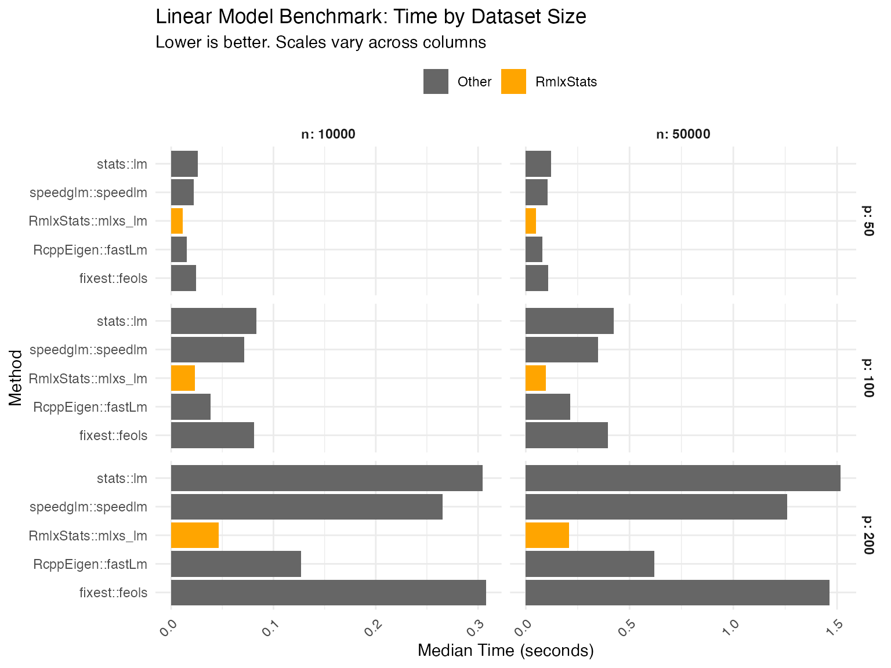
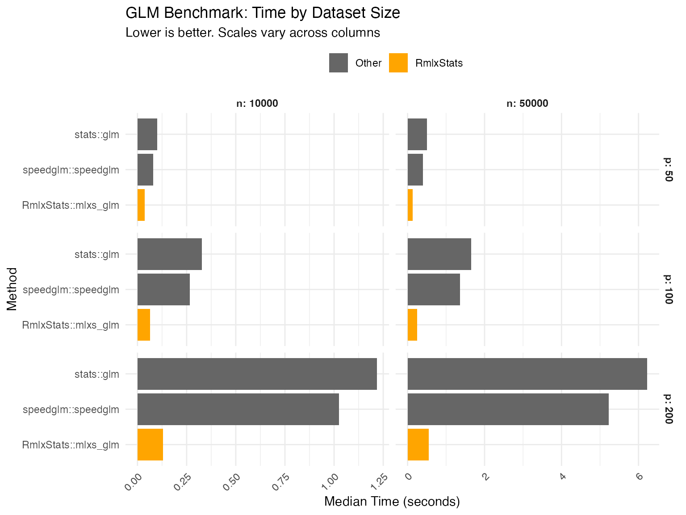
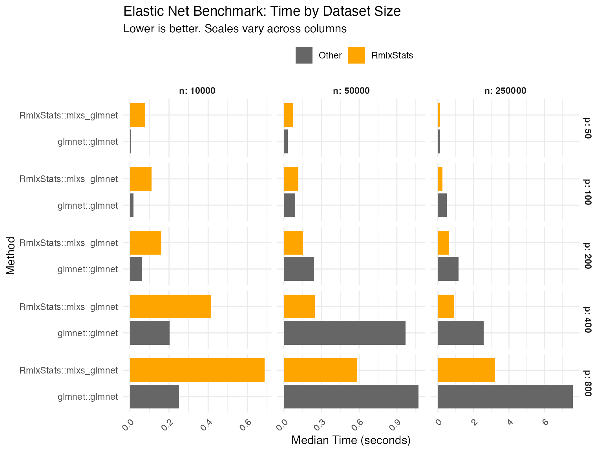
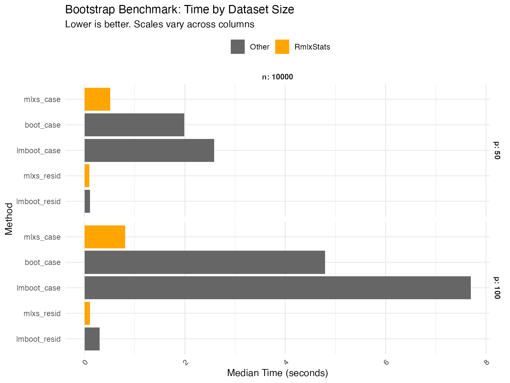

# Benchmarks

We benchmark RmlxStats against base R and specialized fast fitting
packages, across varying numbers of cases (`n`) and predictors (`p`).

Benchmarking was run on an M2 Macbook Air.

## Data Generation

``` r
set.seed(20251111)

n_sizes <- c(10000, 50000, 250000)
p_sizes <- c(50, 100, 200, 400, 800)
n_max <- max(n_sizes)
p_max <- max(p_sizes)

X <- matrix(rnorm(n_max * p_max), nrow = n_max, ncol = p_max)
colnames(X) <- paste0("x", seq_len(p_max))

beta_true <- rnorm(p_max, mean = 0, sd = 0.5)
y_continuous <- drop(X %*% beta_true + rnorm(n_max, sd = 2))

# only 1 in 10 predictors matter:
X_sparse <- X[, seq(10, p_max, 10)]
beta_true_sparse <- beta_true[seq(1, p_max, 10)]
y_sparse <- drop(X_sparse %*% beta_true_sparse + rnorm(n_max, sd = 2))

linpred <- drop(X %*% beta_true) / 5  
prob <- 1 / (1 + exp(-linpred))
y_binary <- rbinom(n_max, size = 1, prob = prob)

full_data <- data.frame(
  y_cont = y_continuous,
  y_bin = y_binary,
  y_sparse = y_sparse,
  X
)


# for fast debugging
if (params$develop) {
  p_sizes <- p_sizes/5
  n_sizes <- n_sizes/10
}

bench_grid <- expand.grid(
  n = n_sizes,
  p = p_sizes,
  stringsAsFactors = FALSE
)

bench_grid <- bench_grid[bench_grid$n > bench_grid$p, ]

all_results <- data.frame()
```

## `lm` Benchmarks

``` r
lm_results <- list()
lm_grid <- bench_grid[bench_grid$n <= 50000 & bench_grid$p <= 200, ]

for (i in seq_len(nrow(lm_grid))) {
  n <- lm_grid$n[i]
  p <- lm_grid$p[i]

  subset_data <- full_data[1:n, c("y_cont", paste0("x", 1:p))]
  formula_str <- paste("y_cont ~", paste(paste0("x", 1:p), collapse = " + "))
  lm_formula <- as.formula(formula_str)

  bm <- mark(
    "stats::lm" = lm(lm_formula, data = subset_data),
    "RmlxStats::mlxs_lm" = {
      l <- mlxs_lm(lm_formula, data = subset_data)
      Rmlx::mlx_eval(l$coefficients)
    },
    "fixest::feols" = feols(lm_formula, data = subset_data),
    "RcppEigen::fastLm" = RcppEigen::fastLm(lm_formula, data = subset_data),
    "speedglm::speedlm" = speedglm::speedlm(lm_formula, data = subset_data),
    iterations = 3,
    check = FALSE,
    filter_gc = FALSE
  )

  bm$n <- n
  bm$p <- p
  bm$model_type <- "lm"
  lm_results[[i]] <- bm
}

lm_df <- do.call(rbind, lm_results)
all_results <- rbind(all_results, lm_df)
```

## `glm` Benchmarks

``` r
glm_results <- list()
glm_grid <- bench_grid[bench_grid$n <= 50000 & bench_grid$p <= 200, ]

for (i in seq_len(nrow(glm_grid))) {
  n <- glm_grid$n[i]
  p <- glm_grid$p[i]

  subset_data <- full_data[1:n, c("y_bin", paste0("x", 1:p))]
  formula_str <- paste("y_bin ~", paste(paste0("x", 1:p), collapse = " + "))
  glm_formula <- as.formula(formula_str)

  bm <- mark(
    "stats::glm" = glm(glm_formula, family = binomial(),
                             data = subset_data,
                             control = list(maxit = 50)),
    "RmlxStats::mlxs_glm" = {
      g <- mlxs_glm(glm_formula, family = mlxs_binomial(),
                        data = subset_data,
                        control = list(maxit = 50, epsilon = 1e-6))
      Rmlx::mlx_eval(g$coefficients)
    },
    "speedglm::speedglm" = speedglm::speedglm(glm_formula, family = binomial(),
                                   data = subset_data),
    iterations = 3,
    check = FALSE,
    filter_gc = FALSE
  )

  bm$n <- n
  bm$p <- p
  bm$model_type <- "glm"
  glm_results[[i]] <- bm
}

glm_df <- do.call(rbind, glm_results)
all_results <- rbind(all_results, glm_df)
```

## `glmnet` Benchmarks

``` r
glmnet_results <- list()
glmnet_grid <- bench_grid

for (i in seq_len(nrow(glmnet_grid))) {
  n <- glmnet_grid$n[i]
  p <- glmnet_grid$p[i]

  xvars <- paste0("x", 1:p)
  x <- full_data[1:n, xvars]
  y <- full_data[1:n, "y_sparse"]

  bm <- mark(
    "glmnet::glmnet" = glmnet::glmnet(x, y, lambda = 1/1:50),
    "RmlxStats::mlxs_glmnet" = mlxs_glmnet(x, y, lambda = 1/1:50),
    iterations = 3,
    check = FALSE,
    filter_gc = FALSE
  )

  bm$n <- n
  bm$p <- p
  bm$model_type <- "glmnet"
  glmnet_results[[i]] <- bm
}

glmnet_df <- do.call(rbind, glmnet_results)
all_results <- rbind(all_results, glmnet_df)
```

## Bootstrap Benchmarks

For bootstrap, we use only the smaller datasets due to computational
cost.

``` r
boot_results <- list()
boot_grid <- bench_grid[bench_grid$n <= 10000 & bench_grid$p <= 100, ]

for (i in seq_len(nrow(boot_grid))) {
  n <- boot_grid$n[i]
  p <- boot_grid$p[i]

  subset_data <- full_data[1:n, c("y_cont", paste0("x", 1:p))]
  formula_str <- paste("y_cont ~", paste(paste0("x", 1:p), collapse = " + "))
  boot_formula <- as.formula(formula_str)

  fit_mlxs <- mlxs_lm(boot_formula, data = subset_data)
  fit_base <- lm(boot_formula, data = subset_data)

  # Bootstrap function for boot package
  boot_stat <- function(dat, idx) {
    coef(lm(boot_formula, data = dat[idx, , drop = FALSE]))
  }

  bm <- mark(
    boot_case = boot::boot(subset_data, statistic = boot_stat,
                          R = 50L, parallel = "no"),
    lmboot_case = lmboot::paired.boot(boot_formula, data = subset_data, 
                                      B = 50L),
    lmboot_resid = lmboot::residual.boot(boot_formula, data = subset_data, 
                                         B = 50L),
    mlxs_case = {
      s <- summary(fit_mlxs, bootstrap = TRUE,
              bootstrap_args = list(B = 50L, seed = 42,
                                   bootstrap_type = "case",
                                   progress = FALSE))
      Rmlx::mlx_eval(s$std.err)
    },
    mlxs_resid = {
      s <- summary(fit_mlxs, bootstrap = TRUE,
              bootstrap_args = list(B = 50L, seed = 42,
                                   bootstrap_type = "resid",
                                   progress = FALSE))
      Rmlx::mlx_eval(s$std.err)
    },
    iterations = 3,
    check = FALSE,
    filter_gc = FALSE,
    memory = FALSE
  )

  bm$n <- n
  bm$p <- p
  bm$model_type <- "Bootstrap"
  boot_results[[i]] <- bm
}

boot_df <- do.call(rbind, boot_results)
all_results <- rbind(all_results, boot_df)
```

## Summary Tables

We compare functions both against base R implementation, and against the
fastest alternative tested.

## `lm` Models

[TABLE]



## `glm` Models

[TABLE]



## `glmnet` Models

[TABLE]



## Bootstraps

[TABLE]


