# Fuzz test results

## Fuzz tests

Fuzz tests live in `tests/testthat/test-fuzz-*`. We test extensively,
aiming to cover hard cases and capture a number of relevant metrics: a
single pass generates about 1000 pieces of data. We can’t always binary
pass/fail, so this page is meant to show our current performance and
also how it has evolved over time.

- What about diagnostics?

``` r

knitr::opts_chunk$set(echo = TRUE)

library(ggtext)
library(glue)
library(here)
library(tidyverse)

fuzz_theme <- theme_minimal() +
  theme(
        plot.background = element_rect("grey95"),
        axis.text.y.left = element_markdown(),
        panel.background = element_rect("white"),
        legend.position = "none"
    )
set_theme(fuzz_theme)

fuzz <- read_csv(here("tests/testthat/fuzz-results/github-macos-26/fuzz-results.csv"))

chosen_tiers <- if (params$tier == "any") c("full", "fast") else params$tier
latest <- function(fuzz) {
  fuzz |> 
    filter(tier %in% chosen_tiers) |> 
    filter(grepl(params$branch, branch)) |> 
    # separate filter statements for a reason, given the max() below
    filter(datetime_utc == max(datetime_utc)) 
}

prettify <- function(x) {
  stringr::str_to_title(gsub("_", " ", x))
}

fuzz <- fuzz |> 
  mutate(
    agg = replace_values(aggregation, "value" ~ ""),
    Target = if_else(agg == "", target, paste0(agg, "(", target, ")")),
    Case_type = prettify(case_type),
    Scenario = paste(prettify(scenario), paste("n", n), paste("p", p), sep = " / ")
  ) 


date <- Sys.Date()
commit <- system("git rev-parse --short HEAD", intern = TRUE)
branch <- system("git branch --show-current", intern = TRUE)
rmlx_version <- packageVersion("Rmlx")
tier <- latest(fuzz)$tier[1]
```

| Metadata     |            |
|--------------|------------|
| Generated on | 2026-05-20 |
| Commit       | ae67404    |
| Branch       | master     |
| Rmlx version | 0.4.0      |
| Tier         | fast       |

### History

``` r

# lm-det: not sure?
# lm-mc: monte carlo bias and ci coverage with SEs
# glm-det: aic and fitted errors; 
# glm-mc: mc bias and ci as for lm-mc; 
# glmnet-det: prediction errors
# cv-glmnet: out of fold predictions
# prcomp-det: subspace and reconstruction error
# prcomp-mc: same

history_theme <- theme(panel.grid = element_blank(), 
                       panel.grid.major.y = element_line(
                         colour = "grey95", linewidth = 0.5))
```

#### Benchmarks

``` r

fuzz |> 
  filter(grepl(params$branch, branch),
         suite == "mlxs-benchmarks") |> 
  ggplot(aes(y = value, x = datetime_utc, colour = scenario)) + 
    geom_point() + 
    geom_line(aes(group = scenario, linetype = tier)) +
    labs(
      y = "Time (seconds)"
    ) +
    history_theme +
    theme(legend.position="bottom")
```

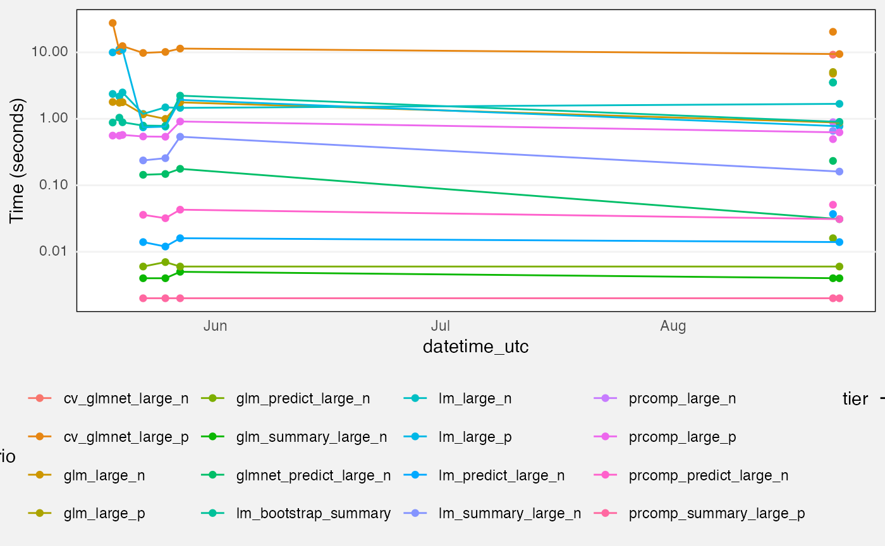

#### Fuzz tests

``` r

fuzz |> 
  filter(grepl(params$branch, branch),
         suite == "mlxs-lm-monte-carlo", 
         measure == "bias") |> 
  ggplot(aes(x = datetime_utc, y = value, group = interaction(tier, term), colour = term)) + 
    geom_pointrange(aes(ymin = value - 1.96 * value_se, 
                        ymax = value + 1.96 * value_se),
                    position = position_dodge(0.5), size = 0.2) +
    geom_line(aes(linetype = tier)) + 
    facet_grid(rows = vars(Scenario)) +
    labs(
      title = "Per-term bias, mlxs_lm() monte carlo",
      y = "Bias"
    ) +
    history_theme
```

    ## Warning: Removed 5 rows containing missing values or values outside the scale range
    ## (`geom_segment()`).

    ## Warning: Removed 75 rows containing missing values or values outside the scale range
    ## (`geom_segment()`).

    ## Warning: Removed 5 rows containing missing values or values outside the scale range
    ## (`geom_segment()`).

    ## Warning: Removed 75 rows containing missing values or values outside the scale range
    ## (`geom_segment()`).

    ## `geom_line()`: Each group consists of only one observation.
    ## ℹ Do you need to adjust the group aesthetic?
    ## `geom_line()`: Each group consists of only one observation.
    ## ℹ Do you need to adjust the group aesthetic?

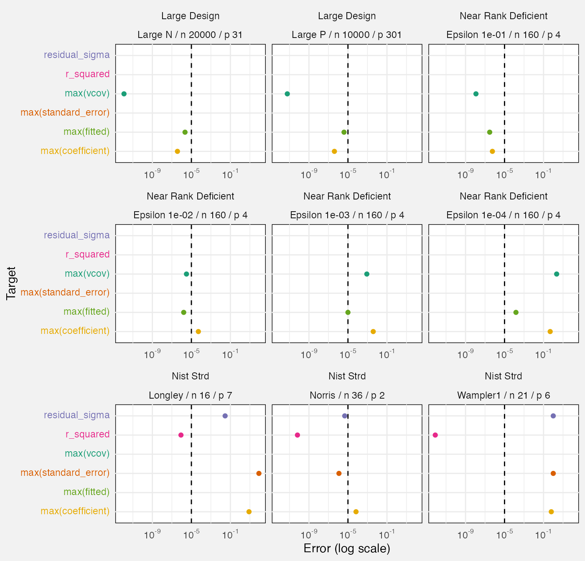

``` r

fuzz |> 
  filter(grepl(params$branch, branch),
         suite == "mlxs-lm-monte-carlo", 
         measure == "coverage") |> 
  ggplot(aes(x = datetime_utc, y = value, group = interaction(tier, term), colour = term)) + 
    geom_hline(yintercept = 0.95, linetype = "dashed", colour = "grey30") +
    geom_pointrange(aes(ymin = value - 1.96 * value_se, 
                        ymax = value + 1.96 * value_se), size = 0.2,
                    position = position_dodge(0.5)) +
    geom_line(aes(linetype = tier)) + 
    facet_grid(rows = vars(Scenario)) +
    labs(
      title = "Confidence interval coverage, mlxs_lm() monte carlo",
      subtitle = "Vertical lines show empirical monte carlo 95% c.i.s",
      y = "Coverage"
    ) +
    history_theme
```

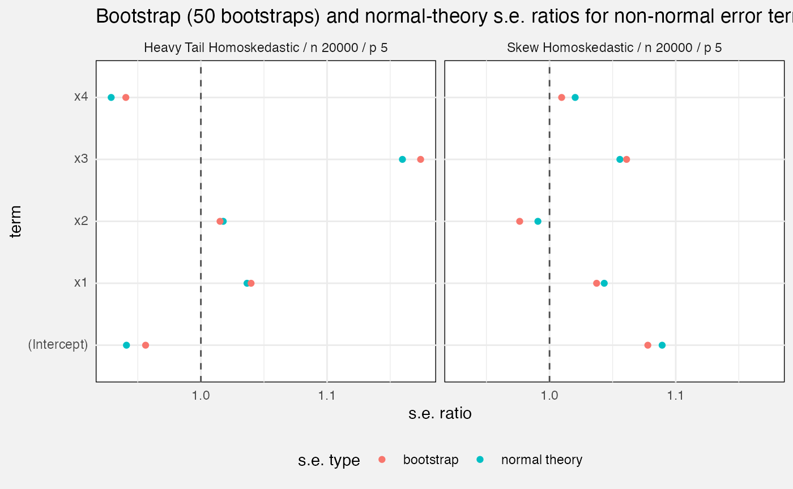

``` r

fuzz |> 
  filter(grepl(params$branch, branch), 
         suite == "mlxs-glm-monte-carlo", 
         measure == "bias") |> 
  ggplot(aes(x = datetime_utc, y = value, group = interaction(tier, term),
             colour = term)) + 
    geom_pointrange(aes(ymin = value - 1.96 * value_se, 
                        ymax = value + 1.96 * value_se),
                    position = position_dodge(0.5), size = 0.2) +
    geom_line(aes(linetype = tier)) + 
    facet_wrap(vars(Scenario, family)) +
    labs(
      title = "Per-term bias, mlxs_glm() monte carlo",
      y = "Bias"
    ) +
    history_theme
```

    ## Warning: Removed 5 rows containing missing values or values outside the scale range
    ## (`geom_segment()`).
    ## Removed 5 rows containing missing values or values outside the scale range
    ## (`geom_segment()`).

    ## `geom_line()`: Each group consists of only one observation.
    ## ℹ Do you need to adjust the group aesthetic?
    ## `geom_line()`: Each group consists of only one observation.
    ## ℹ Do you need to adjust the group aesthetic?
    ## `geom_line()`: Each group consists of only one observation.
    ## ℹ Do you need to adjust the group aesthetic?
    ## `geom_line()`: Each group consists of only one observation.
    ## ℹ Do you need to adjust the group aesthetic?
    ## `geom_line()`: Each group consists of only one observation.
    ## ℹ Do you need to adjust the group aesthetic?

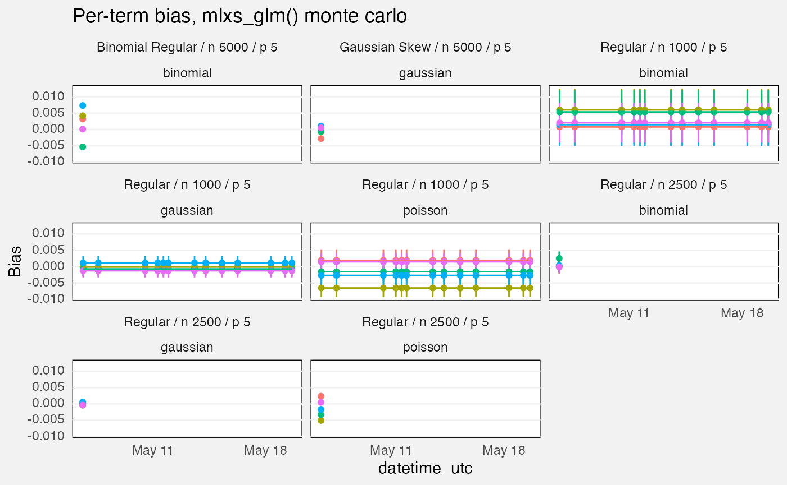

``` r

fuzz |> 
  filter(grepl(params$branch, branch),
         suite == "mlxs-glm-monte-carlo", 
         measure == "coverage") |> 
  ggplot(aes(x = datetime_utc, y = value, group = interaction(tier, term), colour = term)) + 
    geom_hline(yintercept = 0.95, linetype = "dashed", colour = "grey30") +
    geom_pointrange(aes(ymin = value - 1.96 * value_se, 
                        ymax = value + 1.96 * value_se), size = 0.2,
                    position = position_dodge(0.5)) +
    geom_line(aes(linetype = tier)) + 
    facet_wrap(vars(Scenario, family)) +
    labs(
      title = "Per-term confidence interval coverage, mlxs_glm() monte carlo",
      subtitle = "Vertical lines show empirical monte carlo 95% c.i.s",
      y = "Coverage"
    ) +
    history_theme
```

    ## `geom_line()`: Each group consists of only one observation.
    ## ℹ Do you need to adjust the group aesthetic?
    ## `geom_line()`: Each group consists of only one observation.
    ## ℹ Do you need to adjust the group aesthetic?
    ## `geom_line()`: Each group consists of only one observation.
    ## ℹ Do you need to adjust the group aesthetic?

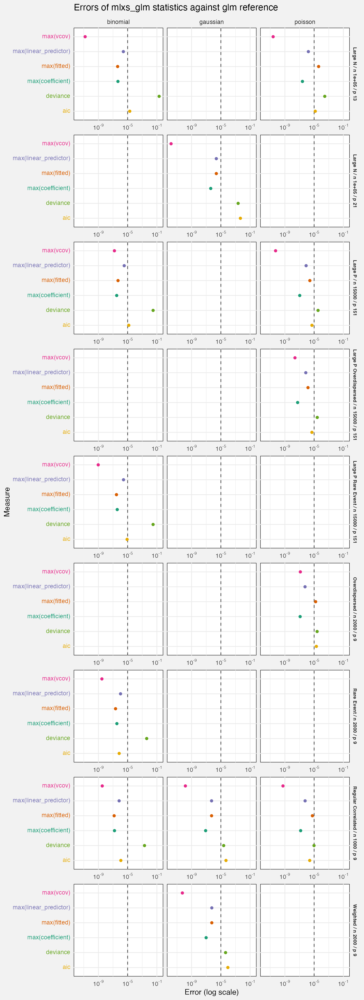

``` r

fuzz |> 
  filter(grepl(params$branch, branch),
         suite == "mlxs-glmnet-deterministic", 
         measure =="loss", 
         target == "prediction", 
         source == "mlx") |> 
  ggplot(aes(x = datetime_utc, y = value, colour = factor(lambda_index))) + 
    geom_point() +
    geom_line() + 
    facet_wrap(vars(Scenario, family), ncol = 3) +
    scale_y_log10() +
    labs(
      title = "Prediction error, mlxs_glmnet() monte carlo"
    ) +
    history_theme + 
    theme(
      legend.position = "bottom"
    )
```

    ## `geom_line()`: Each group consists of only one observation.
    ## ℹ Do you need to adjust the group aesthetic?
    ## `geom_line()`: Each group consists of only one observation.
    ## ℹ Do you need to adjust the group aesthetic?

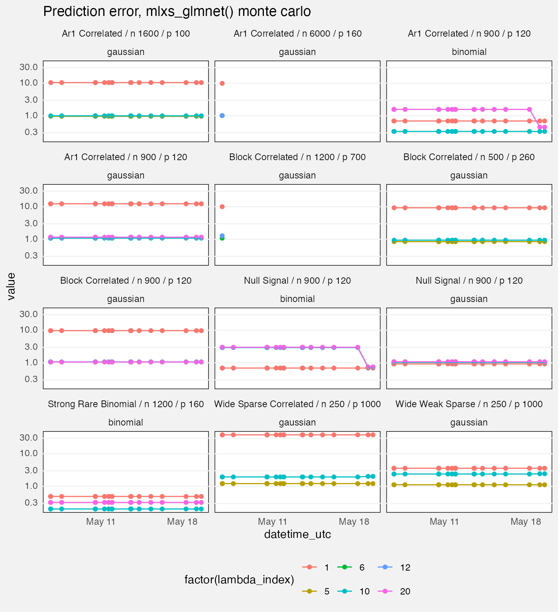

``` r

fuzz |> 
  filter(grepl(params$branch, branch),
         suite == "mlxs-prcomp-deterministic", 
         measure == "error", 
         target == "subspace", 
         source == "mlx") |> 
  ggplot(aes(datetime_utc, value, linetype = tier, colour = tier)) + 
    geom_point() + 
    geom_line() + 
    facet_wrap(vars(Scenario)) +
    scale_y_log10() + 
    labs(
      title = "Subspace error, mlxs_prcomp() deterministic",
      y = "Error (log scale)"
    )
```


``` r

fuzz |> 
  filter(grepl(params$branch, branch),
         suite == "mlxs-prcomp-monte-carlo", 
         measure == "error", 
         target == "subspace", 
         source == "mlx") |> 
  ggplot(aes(datetime_utc, value, linetype = tier, colour = tier)) + 
    geom_point() + 
    geom_line() + 
    facet_wrap(vars(Scenario)) +
    scale_y_log10() + 
    labs(
      title = "Subspace error, mlxs_prcomp() monte carlo",
      y = "Error (log scale)"
    )
```

    ## `geom_line()`: Each group consists of only one observation.
    ## ℹ Do you need to adjust the group aesthetic?
    ## `geom_line()`: Each group consists of only one observation.
    ## ℹ Do you need to adjust the group aesthetic?
    ## `geom_line()`: Each group consists of only one observation.
    ## ℹ Do you need to adjust the group aesthetic?
    ## `geom_line()`: Each group consists of only one observation.
    ## ℹ Do you need to adjust the group aesthetic?

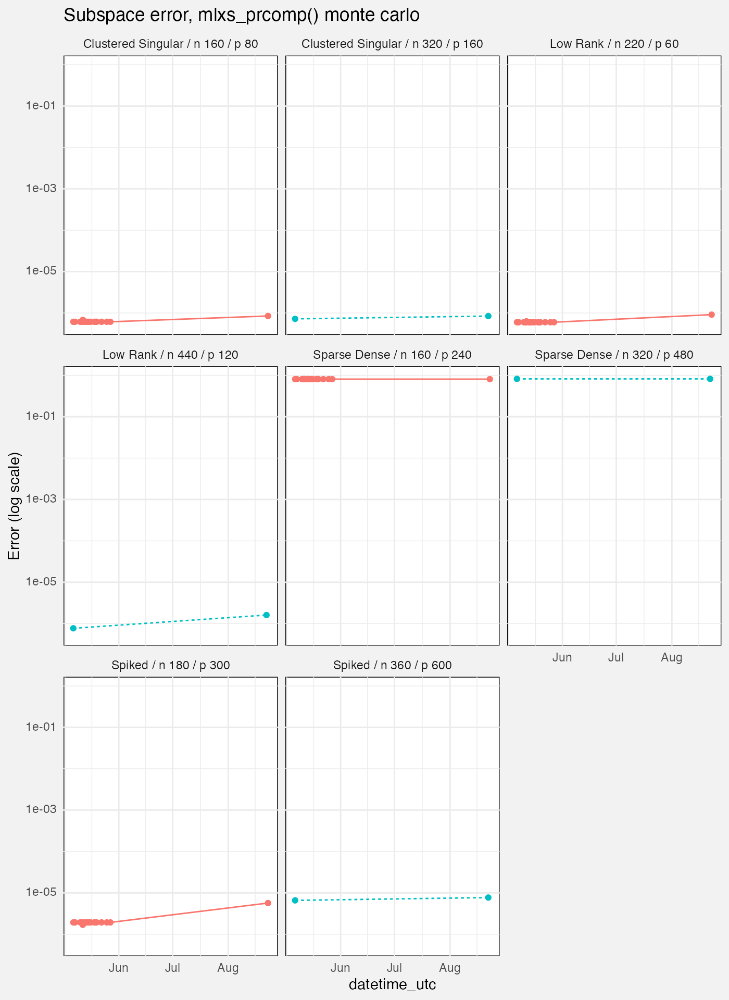

### `mlxs_lm`

#### Deterministic tests

These tests all measure absolute difference of a statistic with a
reference value in different scenarios.

- Longley, Norris and Wamperl are NIST datasets where the reference
  value was calculated independently.
- The “Epsilon”, “Large N” and “Large P” scenarios compare against
  [`stats::lm`](https://rdrr.io/r/stats/lm.html).
  - “Epsilon” refers to near-rank deficient scenarios where one variable
    is equal to another one plus noise times epsilon
- Maximum errors are taken over all elements of the `vcov` matrix;
  per-case `fitted` values; or the set of `coefficient`s and their
  `standard_error`s.

``` r

fuzz_lm_det <- latest(fuzz) |> 
  filter(
    suite == "mlxs-lm-deterministic",
    measure == "error"
  ) |> 
  select(-suite, -family, -term, -(nreps:bootstrap_B))

palette("Dark 2")
cols <- palette()[1:6]
names(cols) <- c("max(vcov)", "max(standard_error)", "residual_sigma",
                 "r_squared", "max(fitted)", "max(coefficient)")
fuzz_lm_det |> 
  ggplot(aes(y = Target, x = value, color = Target)) + 
    geom_vline(xintercept = 1e-5, linetype = "dashed") + 
    geom_point() + 
    facet_wrap(vars(Case_type, Scenario), axes = "all_x") + 
    scale_x_log10(labels = scales::label_math(format = log10)) + 
    scale_color_manual(values = cols) + 
    scale_y_discrete(labels = \(x) sprintf(
      "<span style='color:%s'>%s</span>", cols[x], x)) +
    labs(x = "Error (log scale)")
```

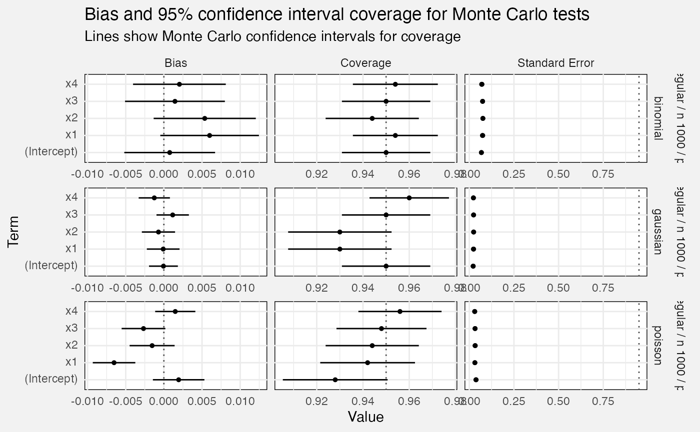

#### Monte Carlo tests

##### Bias and confidence interval coverage

We calculate confidence interval coverage over multiple Monte Carlo
repetitions as the percentage of times the CI covered the term’s true
value. This also lets us generate standard errors, and hence
normal-theory 95% confidence intervals for the true confidence interval
coverage!

Similarly bias is calculated as $`E(estimate - truth)`$ over the Monte
Carlo repetitions, and we calculate standard errors and confidence
intervals the same way.

``` r

fuzz_lm_mc <- latest(fuzz) |> 
  filter(
    suite == "mlxs-lm-monte-carlo"
  ) |> 
  select(-suite, -family, -(alpha:noise_sd))
```

- We calculate the empirical s.e. as the standard deviation of the
  estimates over repeated Monte Carlo runs.
- Ratios much above 1 might be worrying. (How much?)
- We have bias stats. Is there a reason we don’t calculate the Monte
  Carlo s.e.?
- Do we need to record “truth” and “estimate”? Maybe it’s enough to look
  up the code, on the theory we won’t change these much?
- “truth” is recorded as the baseline both for “estimate” and for
  “bias”, which is true but in different senses….
- We have a huge N for the very slow bootstrap, and a tiny N for the
  fast linear model….
- Also, why *is* the bootstrap so slow?

``` r

fuzz_lm_mc |> 
  filter(measure %in% c("bias", "coverage")) |> 
  drop_na(value_se) |> 
  mutate(
    Measure = paste0(measure, " (", term, ")"),
    value_conf_low = value - 1.96*value_se,
    value_conf_hi = value + 1.96*value_se,
    ref_line = if_else(measure=="bias", 0, 0.95)
  ) |> 
  ggplot(aes(y = term, x = value, xmin = value_conf_low, 
             xmax = value_conf_hi)) +
    geom_vline(aes(xintercept = ref_line), linetype = "dotted", 
               colour = "grey30") + 
    geom_pointrange(size = 0.1) +
    facet_grid(vars(Scenario), vars(measure), scales = "free_x", axes = "all_x") +
    labs(
      title = "Bias and 95% confidence interval coverage for Monte Carlo tests",
      subtitle = "Lines show Monte Carlo confidence intervals for coverage",
      x = "Term", y = "Value"
    )
```


##### Standard errors

We compare `mlxs_lm`’s estimated standard errors, either from bootstrap
option or from normal theory, against the empirical standard error,
calculated as the standard deviation of the estimate over all our Monte
Carlo replications.

``` r

bootstrap_B <- na.omit(fuzz_lm_mc$bootstrap_B)
stopifnot(n_distinct(bootstrap_B) == 1)

fuzz_lm_mc |> 
  drop_na(bootstrap_B) |> 
  filter(measure == "standard_error") |> 
  mutate(
    `s.e. type` = replace_values(source, "model" ~ "normal theory")
  ) |> 
  ggplot(aes(y = term, x = value, colour = `s.e. type`)) + 
    geom_pointrange(aes(xmin = value - 1.96 * value_se, xmax = value + 1.96 * value_se),
                    position = position_dodge2(0.25)) +
    facet_wrap(vars(Scenario)) +
    labs(
      title = glue("Bootstrap ({bootstrap_B[1]} bootstraps) and normal-theory standard errors with non-normal errors"),
      subtitle = paste0("Empirical s.e.s are calculated over multiple Monte Carlo runs.\n",
                        "Lines are Monte Carlo standard errors x 1.96 of the s.e. itself"),
      x = "Coefficient s.e."
    ) + 
    theme(
      legend.position = "bottom"
    )
```

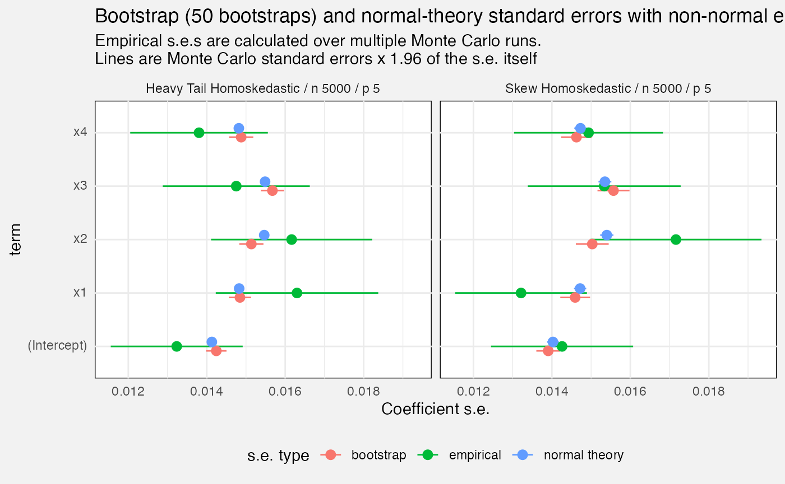

### `mlxs_glm`

#### Deterministic tests

Here we report absolute differences with the `stats:glm` reference
value. For scenario details, look at the code in `test-fuzz-glm-det.R`.

We test gaussian, Poisson and binomial family functions, but not all
families for all scenarios.

The dashed line at $`10^{-5}`$ is a slightly arbitrary breakpoint. In
coefficient and s.e. space we might expect errors to be below this line.

- `case_type` just says deterministic here, different from `mlxs_lm`
  which is more useful.
- The choice of p and n is worth revisiting, maybe Codex has been
  ducking errors…

``` r

fuzz_glm_det <- latest(fuzz) |> 
  filter(suite == "mlxs-glm-deterministic", measure == "error") |> 
  select(-suite, -case_type, -(nreps:term))
```

``` r

cols_glm <- palette()[1:6]
names(cols_glm) <- unique(fuzz_glm_det$Target)

fuzz_glm_det |> 
  ggplot(aes(y = Target, x = value, colour = Target)) + 
    geom_vline(xintercept = 1e-5, linetype = "dashed", colour = "grey30") +
    geom_point() +
    facet_grid(rows = vars(Scenario), cols = vars(family), 
               axes = "all_x") + 
    scale_x_log10(breaks = 10^c(-9, -5, -1), 
                  labels = scales::label_math(format = log10)) + 
    scale_color_manual(values = cols_glm) + 
    scale_y_discrete(labels = \(x) sprintf(
      "<span style='color:%s'>%s</span>", cols_glm[x], x)) +
    labs(
      title = "Errors of mlxs_glm statistics against glm reference",
      x = "Error (log scale)"
    ) + 
    theme(
      strip.text.y = element_text(size = 7, face = "bold")
    )
```

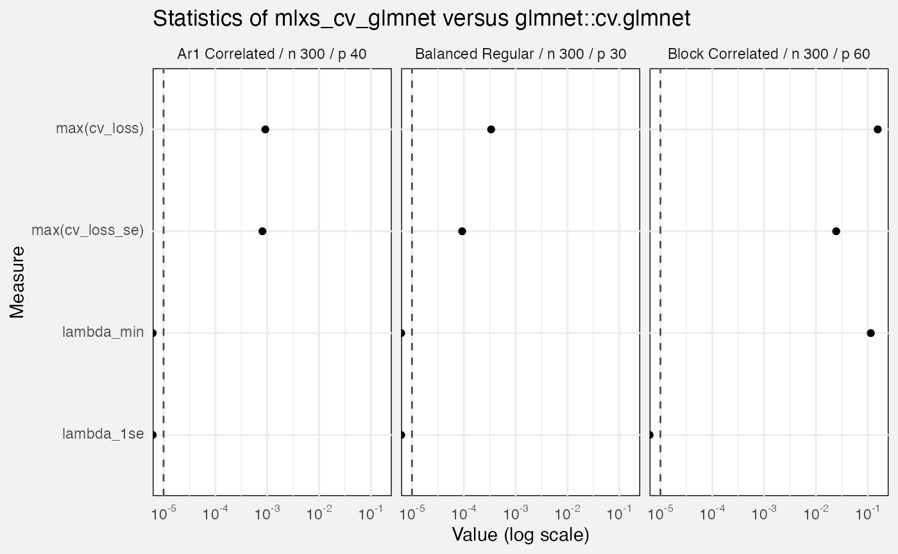

#### Monte Carlo tests

- And here case_type is just “monte carlo”
- The rmse measure really needs a comparison with
  [`stats::glm`](https://rdrr.io/r/stats/glm.html) to be useful, I think
- Is it worth evaluating the standard errors separately from CI
  coverage? Should have a similar message….
- The “full” test should generate glm bootstrap Monte Carlos….

##### Bias and confidence interval coverage

``` r

fuzz_glm_mc <- latest(fuzz) |> 
  filter(suite == "mlxs-glm-monte-carlo") |> 
  select(-suite, -case_type, -(alpha:bootstrap_B))
```

``` r

fuzz_glm_mc |> 
  drop_na(value_se) |> 
  mutate(
    value_conf_low = value - 1.96 * value_se,
    value_conf_hi = value + 1.96 * value_se,
    ref_line = if_else(measure == "bias", 0, 0.95),
    Measure = prettify(measure),
  ) |> 
  ggplot(aes(y = term, x = value, xmin = value_conf_low, 
             xmax = value_conf_hi)) +
    geom_vline(aes(xintercept = ref_line), linetype = "dotted", 
               colour = "grey30") + 
    geom_pointrange(size = 0.1) +
    facet_grid(vars(Scenario, family), vars(Measure), scales = "free", 
               axes = "all_x") + 
    labs(
      title = "Bias and 95% confidence interval coverage for Monte Carlo tests",
      subtitle = "Lines show Monte Carlo confidence intervals for coverage",
      x = "Value", y = "Term"
    )
```

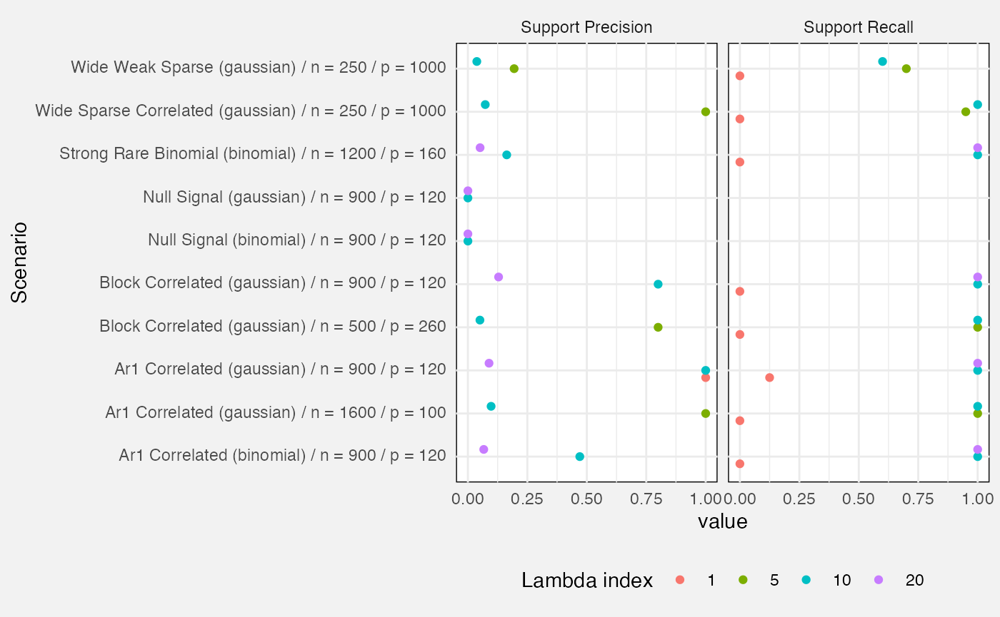

##### Standard errors

``` r

fuzz_glm_mc |> 
  filter(measure == "standard_error") |> 
  mutate(
    Scenario = paste0(Scenario, " (", family, ")"),
    Source = replace_values(source, "model" ~ "normal theory")
  ) |> 
  ggplot(aes(y = term, x = value, colour = Source)) +
    geom_point(position = position_dodge2(0.5)) +
    facet_wrap(vars(Scenario), scales = "free_x", axes = "all_x") + 
    scale_colour_manual(values = c("bootstrap" = "green3", 
                                   "normal theory" = "orange2", "empirical" = "black")) +
    theme(legend.position = "bottom") +
    labs(
      title = "Standard errors, mlx estimates versus empirical Monte Carlo",
      subtitle = "Empirical s.e.s are the standard deviation of the estimate across MC repetitions",
      x = "Standard error"
    )
```

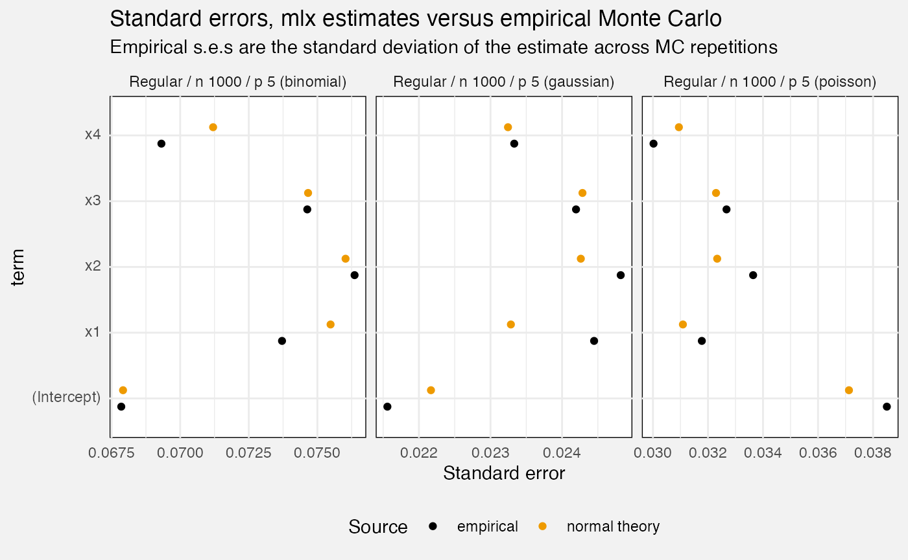

### `mlxs_glmnet`

#### Deterministic tests

``` r

fuzz_glmnet_det <- latest(fuzz) |> 
  filter(suite == "mlxs-glmnet-deterministic") |> 
  select(-suite, -case_type, -nreps, -(rank:bootstrap_B))
```

We measure prediction accuracy against a test set, with the oracle being
the true d.g.p. (i.e. if you know that, how well do you predict the test
set?) We compare glmnet::glmnet as a reference.

``` r

fuzz_glmnet_det |> 
  filter(target == "prediction", measure == "loss") |> 
  mutate(
    `Lambda index` = as.factor(lambda_index),
    Source = replace_values(source, "oracle" ~ "True d.g.p.", "reference" ~ "glmnet")
  ) |> 
  ggplot(aes(y = Scenario, x = value, colour = Source, shape = `Lambda index`)) +
    geom_point(position = position_dodge2(0.75, padding = 0.2)) + 
    facet_grid(cols = vars(family), scales = "free_x") + 
    scale_x_log10() + 
    scale_colour_manual(values = c("True d.g.p." = "black", "mlx" = "orange", 
                                   "glmnet" = "seagreen")) +
    theme(legend.position = "bottom", legend.box = "vertical") +
    labs(
      x = "Loss (log scale)",
      title = "Prediction error (mse or loglikelihood) on test set"
    )
```


We also check values of our objective function (within the training
set). If we do worse than glmnet (positive values of e.g. 0.1 or more)
that suggests we should check performance of the algorithm - we’re not
maximizing what we are trying to maximize.

``` r

fuzz_glmnet_det |> 
  filter(measure=="delta", target=="objective") |> 
  mutate(
    `Lambda index` = as.factor(lambda_index),
    better = value <= 0
  ) |> 
  ggplot(aes(y = Scenario, x = value, shape = `Lambda index`, colour = better)) +
    geom_vline(xintercept = 0, linetype = "dashed", colour = "grey30") +
    geom_point(position = position_dodge2(0.5)) + 
    facet_grid(cols = vars(family), scales = "free_x") + 
    scale_colour_manual(values = c("TRUE" = "green4", "FALSE" = "red"), 
                        guide = "none") +
    theme(legend.position = "bottom") +
    labs(
      x = "Objective delta",
      title = "Achieved objective delta against glmnet::glmnet",
      subtitle = paste0("The objective to minimize is training loss plus a lambda penalty.\n",
                        "Positive values: worse than glmnet; negative: better.")
    )
```

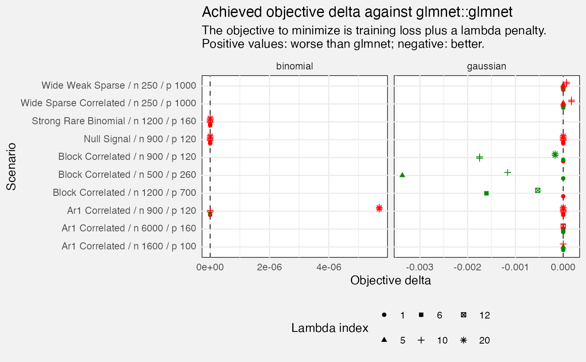

Lastly, we measure precision and recall of the active set (i.e.
variables with a non-zero beta).

- Precision: out of all variables identified by the fit as active, what
  proportion were truly active?
- Recall: out of all truly active variables, what proportion were
  correctly identified?

``` r

fuzz_glmnet_det |> 
  filter(target %in% c("support_precision", "support_recall")) |> 
  mutate(
    Target = prettify(target),
    Scenario = paste0(prettify(scenario), " (", family, ") / n = ", n, " / p = ", p),
    `Lambda index` = factor(lambda_index)
  ) |> 
  ggplot(aes(y = Scenario, x = value, colour = `Lambda index`)) +
    geom_point(position = position_dodge(width = 0.5)) +
    facet_wrap(vars(Target)) +
    theme(legend.position = "bottom")
```

    ## Warning: Removed 15 rows containing missing values or values outside the scale range
    ## (`geom_point()`).

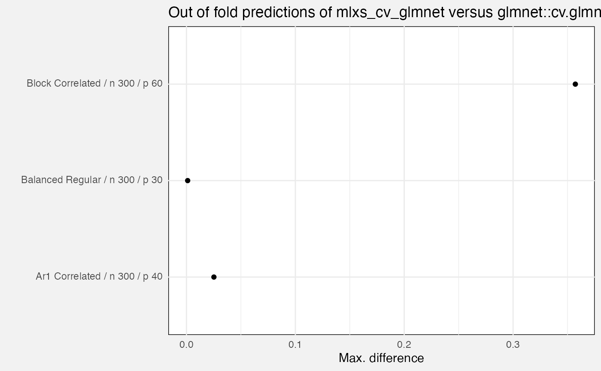

We also examine quality of predictions for an out-of-sample test set.The
loss statistic is mean squared prediction error for Gaussian fits, or
mean binomial negative log-likelihood for binomial fits. We compare
against
[`glmnet::glmnet()`](https://glmnet.stanford.edu/reference/glmnet.html)
as a reference implementation, and also the “oracle” which is the true
data-generating process (hence the best possible prediction in
expectation).

``` r

cols_glmnet <- c("Mlx" = "orange", "Reference" = "grey50", "Oracle" = "black")
fuzz_glmnet_det |> 
  filter(measure == "loss") |> 
  # oracle loss is the same at all values of lambda so let's avoid overplotting
  filter(source != "oracle" | lambda_index == 1) |>
  mutate(
    Source = prettify(source),
    Source = fct_relevel(Source, "Mlx", "Reference", "Oracle"),
    np = paste("n =", n, "/", "p =", p)
  ) |> 
  ggplot(aes(y = Source, x = value, colour = Source, shape = factor(lambda_index))) + 
    geom_point(position = position_dodge(width = 0.5)) +
    facet_grid(rows = vars(prettify(scenario), np), cols = vars(family), 
               scales = "free_x", axes = "all_x") +
    scale_y_discrete(labels = \(x) sprintf(
      "<span style='color:%s'>%s</span>", cols_glmnet[x], x)) +
    scale_colour_manual(values = cols_glmnet, guide = "none") + 
    theme(
      legend.position = "bottom",
      legend.box = "vertical",
      strip.text.y = element_text(size = 7, face = "bold")
    ) +
    labs(
      x = "Loss",
      colour = "Source",
      shape = "Lambda index"
    )
```

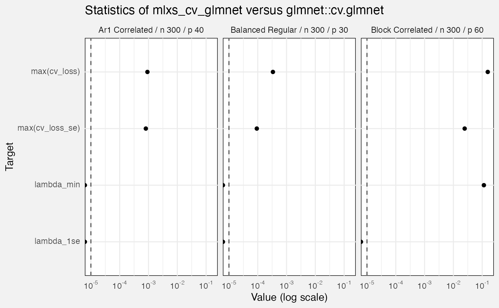

#### Monte Carlo tests

``` r

fuzz_glmnet_mc <- latest(fuzz) |> 
  filter(suite == "mlxs-glmnet-monte-carlo") |> 
  select(-suite, -case_type, -(rank:term))
```

These are only run on the “full” tier.

``` r

if (tier == "full") {
  fuzz_glmnet_mc |> 
    filter(target == "prediction") |> 
    mutate(
      Source = replace_values(source, "reference" ~ "glmnet")
    ) |> 
    ggplot(aes(y = Source, x = value, colour = Source)) + 
      geom_pointrange(aes(xmin = value - 1.96 * value_se, 
                          xmax = value + 1.96 * value_se)) +
      scale_colour_manual(values = c("mlx" = "orange", "glmnet" = "seagreen")) +
      coord_cartesian(xlim = c(0, 0.05)) +
      labs(
        title = "Prediction loss for mlxs_glmnet and glmnet",
        subtitle = paste(fuzz_glmnet_mc$nreps[1], "Monte Carlo reps. Lines show Monte Carlo s.e.s"),
        x = "Loss"
      )
}
```

### `mlxs_cv_glmnet`

``` r

fuzz_cv_glmnet_det <- latest(fuzz) |> 
  filter(suite == "mlxs-cv-glmnet-deterministic") |> 
  select(-(branch:case_type), -nreps, -(lambda_index:nfolds), -(rank:term))
```

We compare
[`mlxs_cv_glmnet()`](https://hughjonesd.github.io/RmlxStats/reference/mlxs_cv_glmnet.md)
to the reference
[`glmnet::cv.glmnet()`](https://glmnet.stanford.edu/reference/cv.glmnet.html).
Errors are:

- `out_of_fold_prediction`: maximum absolute difference for out-of-fold
  predictions
- `cv_loss`: maximum absolute difference of `cvm`, the cross-validated
  error for each value of lambda
- `cv_loss_se`: maximum absolute difference of `cvsd`, the estimated
  s.e. of `cvm`
- Absolute differences in `lambda_min` and `lambda_1se`

``` r

fuzz_cv_glmnet_det |> 
  filter(measure == "error", target == "out_of_fold_prediction") |>
  ggplot(aes(y = Scenario, x = value)) +
    geom_point() +
    labs(
      title = "Out of fold predictions of mlxs_cv_glmnet versus glmnet::cv.glmnet",
      x = "Max. difference",
      y = ""
    )
```

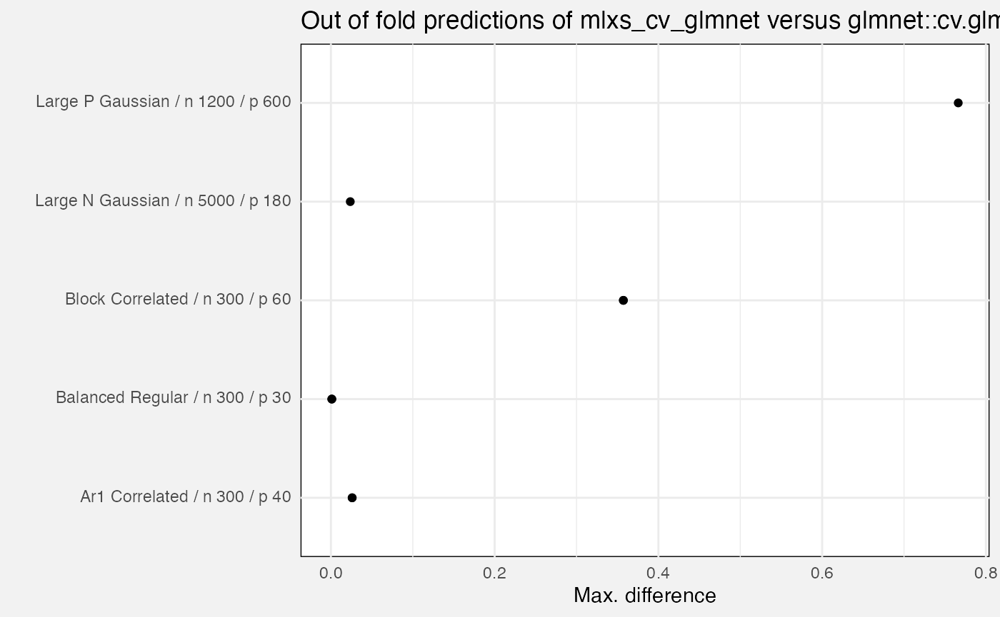

``` r

fuzz_cv_glmnet_det |> 
  filter(measure == "error", target != "out_of_fold_prediction") |> 
  ggplot(aes(y = Target, x = value)) + 
    geom_vline(xintercept = 1e-5, linetype = "dashed", colour = "grey30") + 
    geom_point() +
    facet_wrap(vars(Scenario)) +
    scale_x_log10(labels = scales::label_math(format = log10)) + 
    labs(
      title = "Statistics of mlxs_cv_glmnet versus glmnet::cv.glmnet",
      x = "Value (log scale)"
    )
```

    ## Warning in scale_x_log10(labels = scales::label_math(format = log10)):
    ## log-10 transformation introduced infinite values.


### `mlxs_prcomp`

#### Deterministic tests

``` r

fuzz_prcomp_det <- latest(fuzz) |> 
  filter(suite == "mlxs-prcomp-deterministic") |> 
  select(-suite, -family, -(nreps:lambda), -bootstrap_B, -term) 
```

Scenarios are designed to test hard cases.

- Some test the exact path, some the randomized pca path
- They vary by n, p, rank (of the pca), true rank of the data, and by
  noise which is added to the “systematic” part of the x (so it won’t be
  exactly the true rank matrix)

Metrics include:

- `pca_sdev` : max error compared to the
  [`stats::prcomp`](https://rdrr.io/r/stats/prcomp.html) reference, and
  rmse against the reference. sdev is the standard deviations of the
  principal components/the square roots of the eigenvalues of the
  covariance matrix.
- subspace error compared to the reference; the Frobenius distance
  between matrices.
- reconstruction loss (of the original variables) and delta to the
  reference
- explained variance error, max. delta to the reference. this is also a
  statistic from the `sdev`s.
- we record one “metamorphic” case type; not sure why just for this case
  but anyway I ignore it here as it is more “diagnostic”.
- Need to think about which of these are indicating problems!

``` r

fuzz_prcomp_det |> 
  filter(measure != "diagnostic", Target != "reconstruction",
         case_type != "metamorphic") |> 
  mutate(
    Rank = paste0("Rank ", rank, " (true ", rank_true, ", noise ", noise_sd, ")")
  ) |> 
  ggplot(aes(y = Target, x = value, colour = method)) + 
    geom_vline(xintercept = 1e-5, linetype = "dashed", colour = "grey30") +
    geom_point(position = position_dodge2(width = 0.5)) +
    facet_wrap(vars(Scenario, Rank), axes = "all_x", scales = "free_x", ncol = 2) +
    scale_x_log10(labels = scales::label_math(format = log10)) +
    labs(
      title = "Error metrics for `mlxs_prcomp`",
      subtitle = "Reference is `stats::prcomp`",
      x = "Error (log scale)",
      colour = "PCA Method"
    ) + 
    theme(
      legend.position = "bottom"
    )
```

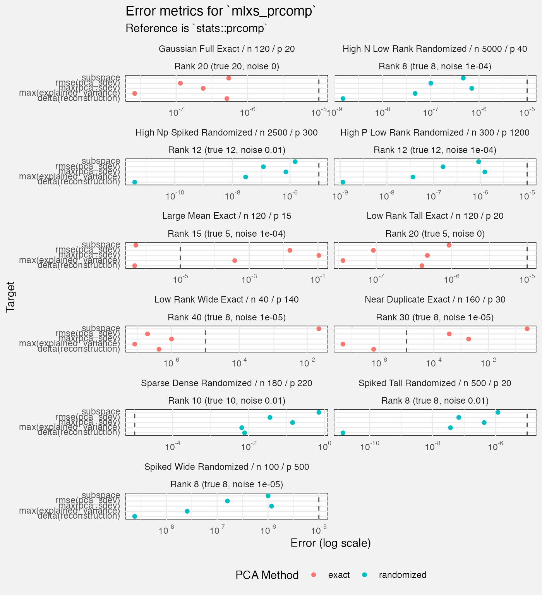

#### Monte Carlo tests

- These have only 12 reps which seems few. Is the Monte Carlo actually
  buying us anything here? We never use it to estimate standard errors.
- As with deterministic case, seems to struggle with “sparse dense”.

``` r

fuzz_prcomp_mc <- latest(fuzz) |> 
  filter(suite == "mlxs-prcomp-monte-carlo") |> 
  select(-suite, -case_type, -family, -(alpha:lambda), -bootstrap_B, -term)
```

``` r

fuzz_prcomp_mc |> 
  filter(measure != "diagnostic", Target != "mean(reconstruction)") |> 
  mutate(
    Rank = paste0("Rank ", rank, " (true ", rank_true, ", noise ", noise_sd, ")")
  ) |> 
  ggplot(aes(y = Target, x = value)) + 
    geom_vline(xintercept = 1e-5, linetype = "dashed", colour = "grey30") +
    geom_point(position = position_dodge2(width = 0.5)) +
    facet_wrap(vars(Scenario, Rank), axes = "all_x", scales = "free_x", ncol = 2) +
    scale_x_log10(labels = scales::label_math(format = log10)) +
    labs(
      title = "Error metrics for mlxs_prcomp Monte Carlo tests",
      subtitle = "Reference is stats::prcomp",
      x = "Error (log scale)"
    )
```

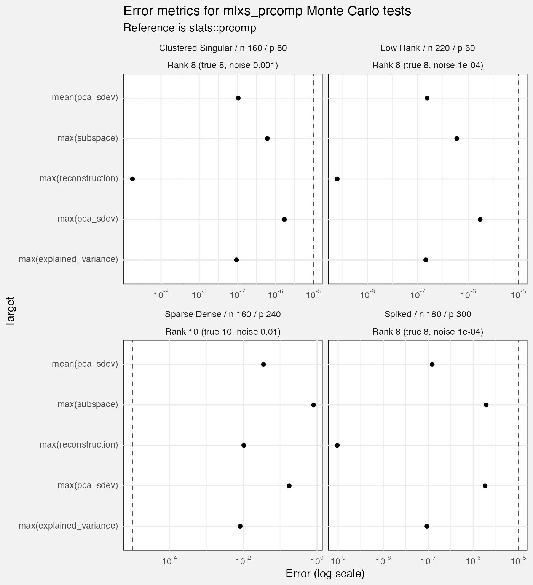
